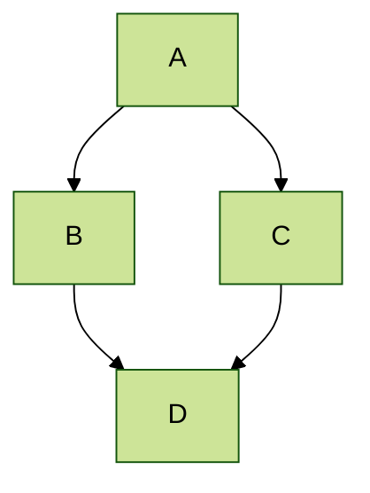
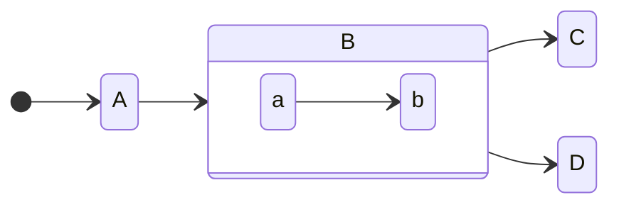
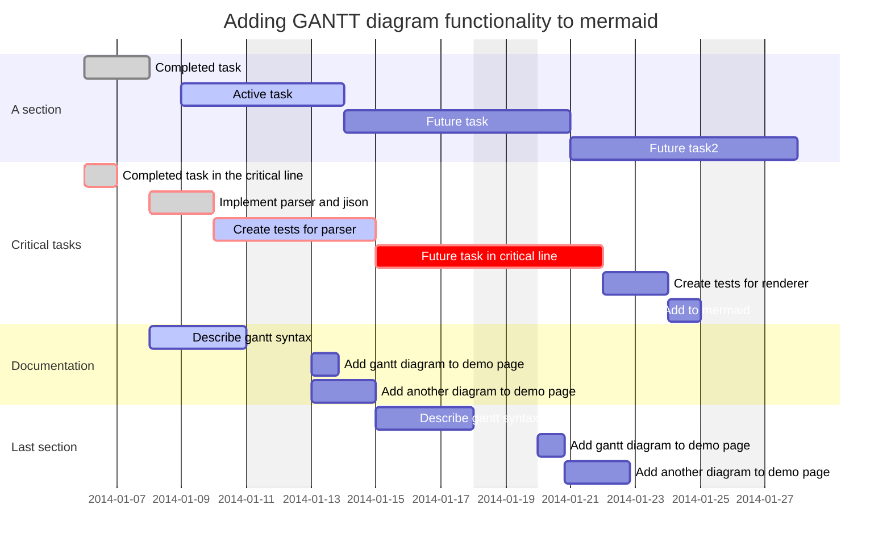
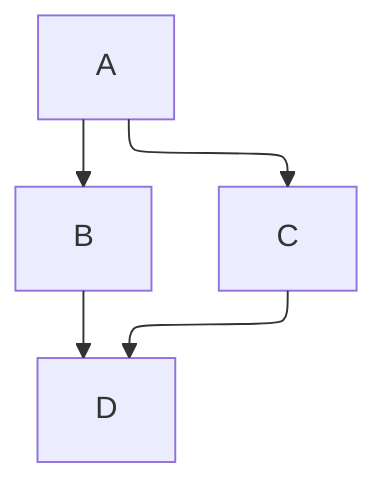

<!-- LLM PROMPT: This document contains all notes from an Emanote notebook.
Each note is separated by '===' delimiters and includes metadata headers.
- Source: The original file path in the notebook
- URL: The full URL where this note can be accessed
- Title: The note's title
- Wikilinks: All possible ways to reference this note using [[wikilink]] syntax

When referencing notes, you can use any of the wikilinks provided.
The base URL is: https://emanote.srid.ca
-->

<!-- Source: architecture.md -->
<!-- URL: https://emanote.srid.ca/architecture -->
<!-- Title: Architecture -->
<!-- Wikilinks: [[architecture]] -->

---
order: 99
tags: [emanote/dev]
slug: architecture
---

# Architecture

Emanote is a [Haskell](https://srid.ca/haskell) program that, at its essense, transforms a bunch of "source files" (Markdown, static files, etc.) into a "target website". It does that in a [reactive](https://en.wikipedia.org/wiki/Reactive_programming) manner such that as the source files change the resultant website updates in real-time (thanks to [Ema](https://ema.srid.ca/)'s [hot-reload](https://ema.srid.ca/topics/hot-reload) via websocket). 

Emanote's high-level architecture is as follows,

- `Emanote.Source`: manages source files and communicates them to `Emanote.Model`.
  - The key concept here is the notion of "union mount", implemented by `Emanote.Source.Mount`, which will eventually be made its own Haskell library.
- `Emanote.Model`: Haskell types & machinary to represent the source files in memory, as well as a way to efficiently index and query into them.
  - The individual modules in this package should be `import`ed separately to use the specific model types.
- `Emanote.Route`: Route types
  - `Emanote.Route.ModelRoute`: Haskell route types to point to somewhere in `Emanote.Model` (eg: route to a .md file, or a route to a .jpeg file)
  - `Emanote.Route.SiteRoute`: Haskell route types pointing to somewhere in the generated site.
- `Emanote.View`: Rendering code (HTML, templates, site routes)
- `Emanote.Pandoc`: Everything to do with light-weight markup processing
  - `Emanote.Pandoc.Markdown`: Markdown-specific parsers and syntax.
  - `Emanote.Pandoc.Renderer`: Emanote-specific transformation of Pandoc AST, via Heist custom splicing.

Ema acts as the framework orchestrating two things at the same time: 

1. `Emanote.Source.emanate` which is responsible for keeping the in-memory `Model` in sync with what's on disk
1. `Emanote.View.render` which, whilst querying the `Model`, is responsible for producing the final HTML for every `SiteRoute` in the target website.

In addition, we have the following non-source files in the Git repository that are vital to Emanote's functionality:

- `./default`: The primary and first "[[layer|layer]]" used, which provides the default HTML templates (we use Heist), `index.md` and a favicon. Users can override these by creating an equivalent file (same path) in their own layer.


===

<!-- Source: examples.md -->
<!-- URL: https://emanote.srid.ca/examples -->
<!-- Title: Examples -->
<!-- Wikilinks: [[examples]] -->

---
order: 10
tags: [external]
slug: examples
---

# Examples

Here is an assorted collection of websites generated by Emanote:

* https://midirus.com/website (view [source](https://github.com/TristanCacqueray/TristanCacqueray.github.io))
* https://ema.srid.ca (view [source](https://github.com/srid/ema/tree/master/docs))
* https://blog.hemera.systems/ (view [source](https://github.com/TheNeikos/hemera.systems))
* https://fiatjaf.com/ (view [source](https://github.com/fiatjaf/z))
* https://srid.ca/ (view [source](https://github.com/srid/srid))
* https://coda-coda.github.io/zettels/ (view [source](https://github.com/coda-coda/zettels))
* https://gil0mendes.io/ (view [source](https://gitlab.com/gil0mendes/website))
* https://input-output-hk.github.io/adrestia/ (view [source](https://github.com/input-output-hk/adrestia/tree/master/docs))
* https://inspirativity.zettel.page/ (view [source](https://github.com/srid/inspirativity.zettel.page))
* https://themotte.zettel.page/ (view [source](https://github.com/Kuratoro/TheMotte.zettel.page))
* https://vanceism7.ml (view [source](https://gitlab.com/vanceism7/site))
* https://plutonomicon.github.io/plutonomicon/ (view [source](https://github.com/Plutonomicon/plutonomicon))
* https://haskell-game.dev/ (view [source](https://gitlab.com/dpwiz/haskell-game.dev))
* https://ners.ch/ (view [source](https://github.com/ners/ners.ch))
* https://zettel.theobori.cafe/ (view [source](https://github.com/theobori/zettel))

Wish to add your Emanote website to the above list? [Tell us here][show-and-tell].

[show-and-tell]: https://github.com/srid/emanote/discussions/new?category=show-and-tell


===

<!-- Source: guide.md -->
<!-- URL: https://emanote.srid.ca/guide -->
<!-- Title: Guide -->
<!-- Wikilinks: [[guide]] -->

---
slug: guide
order: 2
---

# Guide

You probably want to start from [[markdown]], then [[query]] and thereon to [[yaml-config]]. See also [[js]].

```query
path:./*
```


===

<!-- Source: guide/daily-notes.md -->
<!-- URL: https://emanote.srid.ca/daily-notes -->
<!-- Title: Daily Notes -->
<!-- Wikilinks: [[guide/daily-notes]], [[daily-notes]] -->

---
slug: daily-notes
---

# Daily Notes

Emanote has special support for [Obsidian style daily notes](https://help.obsidian.md/plugins/daily-notes).

If you create notes named `YYYY-MM-DD.md`, Emanote will treat them as daily notes. This has a couple of effects:

1. The backlinks panel will render daily notes separate from regular notes. The daily notes will be rendered as a "timeline" in reverse chronological order.
2. Each daily note automatically gets a hierarchical tag (eg: `#calendar/2025/03`) allowing you to browse them by calendar navigation in the tag index.


===

<!-- Source: guide/export.md -->
<!-- URL: https://emanote.srid.ca/export -->
<!-- Title: Export -->
<!-- Wikilinks: [[guide/export]], [[export]] -->

---
slug: export
---

# Export

Emanote supports exporting your notebook content in different formats:

## JSON export {#json}

The metadata of all content ([[markdown]] and [[orgmode]]), along with their link relationships, can be retrieved as `JSON` using one of the following means:

1. `emanote export metadata`: a CLI command that dumps the JSON export to stdout.
2. [/-/export.json](-/export.json): an URL to retrieve the JSON via live server or from the statically generated site.

## Content export {#md}

All notes from your notebook can be exported as a single Markdown document optimized for LLMs using:

1. `emanote export content`: a CLI command that dumps the content export to stdout.
2. [/-/export.md](-/export.md): an URL to retrieve the content via live server or from the statically generated site.

The content export includes:
- All notes with their original Markdown content
- Metadata headers with source paths, titles, and wikilinks
- Optional URLs (when `page.siteUrl` is configured in your notebook)
- LLM-optimized formatting with clear note delimiters

## CLI examples

### JSON export examples {#json-ex}

Here are some examples of running `emanote export metadata`. These commands are run on the `./docs` directory of the Emanote source repository.

```sh
git clone https://github.com/srid/emanote.git
cd ./emanote/docs
```

#### Get the list of files

```sh
$ emanote export metadata | jq .files | jq keys
[
  "architecture.md",
  "demo.md",
  "demo/custom-style.md",
  "demo/embed.md",
  "demo/file-links.md",
  [..]
]
```

#### Get a single file

```sh
$ emanote export metadata | jq '.files | .[] | select(.filePath=="architecture.md")'   
{
  "filePath": "architecture.md",
  "links": [],
  "meta": {
    "order": 99,
    "page": {
      "description": "Emanote is a Haskell program that, at its essense, transforms a bunch of source files (Markdown, static files, etc.) into a target website. It does that in a reactive manner such that as the source files change the resultant website updates in real-time (thanks to Ema's hot-reload via websocket)."
    },
    "tags": [
      "emanote/dev"
    ]
  },
  "parentNote": "index.md",
  "title": "Architecture",
  "url": "architecture"
}
```

#### Get all link targets from a note

```sh
$ emanote export metadata | jq '.files | .[] | select(.filePath=="start/neuron.md") | .links | .[] | .resolvedRelTarget.contents'
"demo/neuron-layout"
"demo/yaml-config"
"demo/yaml-config"
"demo/file-links"
"demo"
```

#### Get the list of tags

```sh
$ emanote export metadata | jq '.files | .[] | .meta.tags' | jq -s 'flatten(1)'
[
  "emanote/dev",
  "emanote/syntax/demo",
  "emanote/syntax/demo",
  "emanote/syntax/demo",
  "emanote/yaml/demo",
  "external"
]
```

#### Get all files associated with a tag

```sh
$ emanote export metadata | jq '.files | .[] | select( any( .meta.tags[]; . == "external" ))'   
{
  "filePath": "examples.md",
  "links": [],
  "meta": {
    "order": 10,
    "page": {
      "description": "Here is an assorted collection of websites generated by Emanote, sorted alphabetically:"
    },
    "tags": [
      "external"
    ]
  },
  "parentNote": "index.md",
  "title": "Examples",
  "url": "examples"
}
```

===

<!-- Source: guide/feed.md -->
<!-- URL: https://emanote.srid.ca/feed -->
<!-- Title: ATOM feed -->
<!-- Wikilinks: [[guide/feed]], [[feed]] -->

---
slug: feed
---

# ATOM feed

An atom feed can be generated for a given note [[query|query]] by adding the following to the [[yaml-config|note metadata]]:

~~~markdown
---
feed:
  enable: true
---

# My blog

```query
path:blog/*
```
~~~

If the note is named `blog.md`, then the feed will be available at `blog.xml`.

> [!note] `page.siteUrl`
> You must set `page.siteUrl` (see below) in the [[yaml-config|index.yaml]] for the feed to be generated.

## Example

An example is available in the [[query]] note. You can access its feed at [query.xml](query.xml).

## Configuration

Here are the supported settings:

- `feed.title`: the feed title, default to the note title.
- `feed.limit`: the maximum number of notes to include in the feed.

The feed is constructed from the first and only query of the note.


===

<!-- Source: guide/folder-note.md -->
<!-- URL: https://emanote.srid.ca/folder-note -->
<!-- Title: Folder notes -->
<!-- Wikilinks: [[guide/folder-note]], [[folder-note]] -->

---
slug: folder-note
---

# Folder notes

For every folder `foo/` in your notebook, if a `foo.md` exists alongside it, it is consider a "folder note" that is associated with the folder. Likewise, an associated `foo.yaml` servers as the [[yaml-config]] for the entire folder and its contents recursively.

The children of folder notes become its [[folgezettel|folgezettel]] children by default.

{#index}
## `index.md`

Instead of `foo.md`, you can also use `foo/index.md` (or `index.org` if using [[orgmode]]) or `foo/index.yaml`. Internally, Emanote will treat them as `foo.md` and `foo.yaml` respectively.

===

<!-- Source: guide/folgezettel.md -->
<!-- URL: https://emanote.srid.ca/folgezettel -->
<!-- Title: Folgezettel links -->
<!-- Wikilinks: [[guide/folgezettel]], [[folgezettel]] -->

---
slug: folgezettel
---

# Folgezettel links

Wikilinks can be of special type called a "folgezettel". They are created with a special variation of emanote link syntax.

Conceptually, a [folgezettel](https://neuron.zettel.page/folgezettel-heterarchy) link can be thought of as an arrow from a parent note to a descendent note.

## Syntax

```markdown
## A folgezettel link from another page to this one:

Here is the #[[source-note]]

## A folgezettel link from this page to another one:

Here is the [[target-note]]#
```

{#folder}
## [[folder-note|Folder notes]]

By default, Emanote includes any directories in your note's path as vertices in the folgezettel graph. This makes the [[folder-note|folder note]] a folgezettel parent of the child note. The contents of a folder, likewise, become folgezetten children of the [[folder-note|folder note]]. For eg., in `foo/bar/qux.md`, "foo" is a folgezettel parent of "bar", and "bar" is a folgezettel parent of "qux".

>[!note]
> The top-level root folder is not considered a folgezettel by default, unless you specify it (as shown below). This is to support the use-case of the user having a *flat list* of notes *without* subdirectories, but connected through [[folgezettel]].

This behavior can be configured. To turn it off on a per-folder basis, set the corresponding flag in [[yaml-config|your configuration]] to `false` as shown here:

```yaml
emanote:
  # Whether to automatically treat the contents of this 
  # folder note as its folgezettel children
  folder-folgezettel: false
```

>[!tip]
> Put this configuration in `foo.md` if you want to disable folder folgezettel for just that [[folder-note|folder note]] `foo/`. Put it in `foo.yaml` if you want to disable it for `foo/` and all subfolders under it recursively. Put it in top-level `index.yaml` to disable it for all folders. See [[yaml-config]] for more details.

===

<!-- Source: guide/html-template.md -->
<!-- URL: https://emanote.srid.ca/html-template -->
<!-- Title: HTML Templates -->
<!-- Wikilinks: [[guide/html-template]], [[html-template]] -->

---
slug: html-template
---

# HTML Templates

Unlike [[neuron|Neuron]], Emanote's generated HTML can be **completely** customized. Emanote uses the Heist HTML template system that supports non-trivial constructs like recursion; see [here](https://snapframework.com/docs/tutorials/heist) for a tutorial on its syntax. 

The default HTML templates are stored in the [[layer|default layer]], which can you override either totally or in subset. 

## Default Layout

Emanote includes a default layout that includes a [[sidebar]], but can be customized to mimic [[neuron-layout]]. You may also write your own HTML layout from scratch, as long as you specify that template in [[yaml-config]] for the notes in question. For eg., [`templates/home.tpl`](https://github.com/srid/srid/blob/master/templates/home.tpl) is how https://srid.ca homepage is generated, because its [`index.md`](https://raw.githubusercontent.com/srid/srid/master/index.md) specifies this template as `template.name` in its YAML frontmatter (which could also be `index.yaml`).

## Features

```query
children:.
```


===

<!-- Source: guide/html-template/breadcrumbs.md -->
<!-- URL: https://emanote.srid.ca/breadcrumbs -->
<!-- Title: Breadcrumbs -->
<!-- Wikilinks: [[guide/html-template/breadcrumbs]], [[html-template/breadcrumbs]], [[breadcrumbs]] -->

---
slug: breadcrumbs
---


# Breadcrumbs

On mobile view, [breadcrumbs] are displayed at the top. The path of the crumbs is determined from the filesystem path of the associated source file. Breadcrumbs can be disabled in [[yaml-config]]; see [[neuron-layout]] for an example.

>[!warning] Folgezettel
> Breadcrumbs do not use [[folgezettel]].

[breadcrumbs]: https://en.wikipedia.org/wiki/Breadcrumb_navigation

===

<!-- Source: guide/html-template/dark-mode.md -->
<!-- URL: https://emanote.srid.ca/dark-mode -->
<!-- Title: Dark Mode -->
<!-- Wikilinks: [[guide/html-template/dark-mode]], [[html-template/dark-mode]], [[dark-mode]] -->

---
slug: dark-mode
---

# Dark Mode

Emanote includes built-in dark mode support using Tailwind CSS. The dark mode feature automatically detects and follows your system's color scheme preference.

## Features

- **Automatic Detection**: Respects your system's dark mode preference by default
- **Tailwind Integration**: Uses Tailwind CSS's `prefers-color-scheme` media query strategy
- **Comprehensive Coverage**: All page elements adapt to dark mode including content, navigation, and UI components

## Controlling Dark Mode

Dark mode automatically follows your system's color scheme preference. To manually toggle dark mode, we recommend using a browser extension like:

- **Chrome**: [Dark Mode Toggle](https://chromewebstore.google.com/detail/chrome-dark-mode-toggle/idnbggfpadjhjicgjmhlpeilafaplnhd?hl=en)
  - Note: You may need to enable the "Experimental Web Platform Features" flag at `chrome://flags` for the extension to work properly
- **Firefox**: Similar extensions available in Firefox Add-ons

These extensions override the system preference and allow you to toggle dark mode for any website.

## Customization

### Adding Dark Mode Classes

When customizing templates, use Tailwind's `dark:` prefix to add dark mode variants:

```html
<div class="bg-white dark:bg-gray-800 text-gray-900 dark:text-gray-100">
  Content that adapts to dark mode
</div>
```

### CSS Custom Styles

For custom CSS, target the `.dark` class that gets added to the HTML root:

```css
/* Light mode styles */
.my-element {
  background-color: #ffffff;
  color: #1f2937;
}

/* Dark mode styles */
.dark .my-element {
  background-color: #1f2937;
  color: #f3f4f6;
}
```

## Technical Implementation

The dark mode functionality is implemented through:

1. **Media Query Detection**: Uses `@media (prefers-color-scheme: dark)` to detect system preference
2. **Tailwind CSS**: Uses Tailwind's `dark:` prefix utilities that respond to the media query
3. **Automatic Switching**: No JavaScript required - works purely with CSS media queries

===

<!-- Source: guide/html-template/external-links.md -->
<!-- URL: https://emanote.srid.ca/external-links -->
<!-- Title: External links -->
<!-- Wikilinks: [[guide/html-template/external-links]], [[html-template/external-links]], [[external-links]] -->

---
slug: external-links
page:
  headHtml: |
    <snippet var="js.mathjax" />
---

# External links

A link whose address begins with an [URI scheme](https://en.wikipedia.org/wiki/Uniform_Resource_Identifier#Syntax) component is considered an **external link**. 

## Heuristic 

Emanote displays an icon next to an external hyperlink if its description contains some text, including inline code and math formulas.[^noneg]  The heuristic is intended to make the site look good in most cases. 

### Overriding the heuristic

This behaviour can be overriden by setting the value of the `data-linkicon` [data attribute](https://developer.mozilla.org/en-US/docs/Web/HTML/Global_attributes/data-*) of a link:

| Attribute to use                               | Description                                    |
| ---------------------------------------------- | ---------------------------------------------- |
| `{data-linkicon=external}`                     | *Force* displaying the icon next to the link   |
| `{data-linkicon=none}` or `{data-linkicon=""}` | *Prevent* displaying the icon next to the link |

[^noneg]: A common non-example is a hyperlink containing only an image in the description.

Note that the attribute can also be used to display the icons in the [[html-template|HTML templates]] (like the footer or the sidebar) or in raw HTML of [[markdown]].

## URL properties

The displayed icon may depend on the link properties (e.g. the actual URI scheme). This is [[custom-style|customized using CSS]]. By default, Emanote displays a different icon if the URI scheme component is `mailto:`. Check the <https://github.com/srid/emanote/tree/master/emanote/default/templates/base.tpl> of [[html-template|HTML template]] for details.

## Demo

* Default styling:
  * [the emanote repo](https://github.com/srid/emanote)
  * [why the external link symbol ![[external-link-icon.svg]] is not in Unicode](https://www.unicode.org/alloc/nonapprovals.html)
  * [$e^{i \pi} + 1 = 0$](https://en.wikipedia.org/wiki/Euler%27s_identity)
  * [`(>>=) :: forall a b. m a -> (a -> m b) -> m b`](https://hackage.haskell.org/package/base/docs/Prelude.html#v:-62--62--61-)
  * [![[hello-badge.svg]]](https://emanote.srid.ca)
  * mother_hetchel@weaversguild.com
* `{data-linkicon=none}` used to suppress the icon:
  * Water's formula is [H](https://en.wikipedia.org/wiki/Hydrogen){data-linkicon=none}₂[O](https://en.wikipedia.org/wiki/Oxygen){data-linkicon=none}.
  * A 90's style hyperlink:
    [➡➡➡ **CLICK HERE!!!** ⬅⬅⬅](https://emanote.srid.ca){class="shadow-lg border-8 rounded-md bg-yellow-400 border-red-200" data-linkicon=none}
* `{data-linkicon=external}` used to forcefully show the icon
  * [![[pIqaD.svg]]](https://en.wikipedia.org/wiki/Klingon_scripts){data-linkicon=external}


===

<!-- Source: guide/html-template/fonts.md -->
<!-- URL: https://emanote.srid.ca/fonts -->
<!-- Title: Fonts and Typography -->
<!-- Wikilinks: [[guide/html-template/fonts]], [[html-template/fonts]], [[fonts]] -->

---
slug: fonts
---

# Fonts and Typography

Emanote uses a **system font stack** as the default font family throughout the site. This provides excellent performance and native appearance across all platforms without requiring any font downloads. If you want to customize the typography:

## Changing the Font Family

To use a different font, create a `templates/styles.tpl` file in your notebook and override the global font styling (in [[layer|default layer]]):

```html
<style data-category="global-font">
  /* Replace system fonts with your preferred font */
  body {
    font-family: 'Your Font Name', -apple-system, BlinkMacSystemFont, 'Segoe UI', Roboto, Oxygen, Ubuntu, Cantarell, sans-serif;
  }
</style>
```

## Using Google Fonts {#google}

Create `templates/styles.tpl` with both the font import and the styling:

```html
<link rel="preconnect" href="https://fonts.googleapis.com">
<link rel="preconnect" href="https://fonts.gstatic.com" crossorigin>
<link href="https://fonts.googleapis.com/css2?family=Inter:wght@400;500;600;700&display=swap" rel="stylesheet">

<style data-category="global-font">
  body {
    font-family: 'Inter', sans-serif;
  }
</style>
```

## Self-hosting Custom Fonts {#custom}

To self-host your own fonts:

1. Create a `_emanote-static/fonts/` directory in your notebook
2. Add your font files (`.ttf`, `.woff2`, etc.)
3. Create `templates/styles.tpl` with `@font-face` declarations:

```html
<style data-category="custom-fonts">
  @font-face {
    font-family: 'YourFont';
    src: url('${ema:emanoteStaticLayerUrl}/fonts/YourFont.woff2') format('woff2');
    font-weight: 400;
    font-style: normal;
  }

  body {
    font-family: 'YourFont', sans-serif;
  }
</style>
```


===

<!-- Source: guide/html-template/neuron-layout.md -->
<!-- URL: https://emanote.srid.ca/neuron-layout -->
<!-- Title: Neuron-like layout -->
<!-- Wikilinks: [[guide/html-template/neuron-layout]], [[html-template/neuron-layout]], [[neuron-layout]] -->

---
slug: neuron-layout
short-title: Neuron layout
template:
  uptree: 
    enable: true
  sidebar: 
    enable: false
  breadcrumbs: 
    enable: false
  toc:
    enable: false
  base:
    containerClass: container mx-auto max-w-prose
---

# Neuron-like layout

Emanote's builtin [[html-template|HTML template]] layout can be configured to toggle UX features on or off. The default configuration includes [[sidebar]], [[toc]] and [[breadcrumbs]] but hides the [[uptree]]. To mimic the layout used by [Neuron](https://neuron.zettel.page/), turn off sidebar and breadcrumbs while enabling the uptree. Add this to your [[yaml-config]]:

```yml
template:
  uptree: 
    enable: true
  sidebar: 
    enable: false
  breadcrumbs: 
    enable: false
  toc:
    enable: false
  base:
    containerClass: container mx-auto max-w-prose
```

This includes the [[uptree]] of Neuron based on folgezettel links as well as directory layout. Note that all top-level notes are automatically made a folgezettel branch of the root note (index), such that the "home" link appears on top in the uplink tree of all notes. 

> [!tip] Demo
> As a demo, the very page you are viewing is rendered using this template configuration (whilst leaving the rest of the site to use the default configuration)

## In lieu of sidebar

In the absence of [[sidebar]], you may use the [[query|folgezettel children query]] to show the children of the current note. Example below:

```query
children:.
```

===

<!-- Source: guide/html-template/ogp.md -->
<!-- URL: https://emanote.srid.ca/ogp -->
<!-- Title: Open Graph Protocol (OGP) -->
<!-- Wikilinks: [[guide/html-template/ogp]], [[html-template/ogp]], [[ogp]] -->

---
slug: ogp
---

# Open Graph Protocol (OGP)

The [Open Graph protocol](https://ogp.me/) specifies what goes in `<meta>` attributes of the HTML which in turn generates "preview cards" for social sites and apps like X.com, Facebook, Slack, etc.


Emanote generates OGP meta tags for each note, using the following rules:

| Meta tag         | How the value is determined          |
| ---------------- | ------------------------------------ |
| `og:title`       | The title of the note                |
| `og:description` | The first paragraph of the note[^wl] |
| `og:site_name`   | The site name from [[yaml-config\|page.siteTitle]] |
| `og:type` | `website` |
| `og:image` | The first image[^img] in the note, if any; otherwise, use the `image` [[yaml-config\|YAML metadata]] |

## Twitter

[Twitter Card](https://developer.twitter.com/en/docs/twitter-for-websites/cards/overview/abouts-cards) style can be set using `page.twitter.card` [[yaml-config|YAML metadata]]. It it set to `summary_large_image` by default.

[^wl]: Wikilinks like `[[foo]]` render *as is* (due to a limitation). However, `[[foo|some text]]` will render as `some text` (the link text). If you do not wish to have wikilink syntax appearing in page description, specify a custom like in the second example.

[^img]: Unfortunately, embed wikilinks (eg.: `![[foo.jpeg]]`) are not recognized here. You should use regular links, eg.: ``.


===

<!-- Source: guide/html-template/search.md -->
<!-- URL: https://emanote.srid.ca/search -->
<!-- Title: Full-text search -->
<!-- Wikilinks: [[guide/html-template/search]], [[html-template/search]], [[search]] -->

---
slug: search
order: -90
---
# Full-text search

Emanote provides client-side full-text search using [Stork](https://stork-search.net/)[^1]. Search should work in both live server and the statically generated site.

You can trigger search input in one of the following ways:

- Press <kbd>Ctrl+K</kbd> (or <kbd>⌘K</kbd> on macOS).
- Click the lens icon on the sidebar 
  - If the sidebar is disabled (eg.: you are on [[neuron-layout]]), the search lens icon will be on the top-right corner.

## Including frontmatter in the search index

By default, Stork doesn't include the text in the frontmatter as searchable.

This can be changed by adding the following to [[yaml-config|`index.yaml`]]:

```yaml
template:
  stork:
    frontmatter-handling: ignore
```

The possible values are `ignore`, `omit` and `parse`. Default `omit`. See the Stork [docs](https://stork-search.net/docs/config-ref#frontmatter_handling).

This allows you to search by your frontmatter metadata (eg: tags) instead of just markdown body. Note that you may also get undesired results when searching words including non-relevant parts of the YAML frontmatter, like `order` or `date`; this is why the default is `omit`.


## Known issues

- In live server mode, you may find that the browser will fetch remote assets (the wasm file) from files.stork-search.net. See details [here](https://github.com/jameslittle230/stork/issues/317#issuecomment-1258682222).

[^1]: The Stork index file can be accessed at [`-/stork.st`](-/stork.st).


===

<!-- Source: guide/html-template/sidebar.md -->
<!-- URL: https://emanote.srid.ca/sidebar -->
<!-- Title: Sidebar -->
<!-- Wikilinks: [[guide/html-template/sidebar]], [[html-template/sidebar]], [[sidebar]] -->

---
slug: sidebar
---

# Sidebar

In [[html-template|the default template]], the sidebar is rendered on the left side. The sidebar tree is determined from [[folgezettel|folgezettel heterarchy]].

- The sidebar tree is collapsed by default. But this can be disabled by setting `template.sidebar.collapsed` to `false` in [[yaml-config]]
- The ordering of children in the tree is determined in the following order (this is also the order in which [[query]] results are rendered by default):
  1. if `template.sidebar.folders-first` is set to `true` (default `false`), directories (see [[folder-note]]) are put before single notes, respecting the other order criteria. Otherwise, directories and notes will be interleaved.
  2. If the `order` [[yaml-config|frontmatter]] metadata exists, use that as the primary sort key.
  3. If the note has a H1 title, use that as the secondary sort key; otherwise, use the note filename as the secondary sort key.

## Customizing page title

The sidebar will use a page's title by default, but you can override the sidebar item text by setting the `short-title` [[yaml-config|frontmatter]] property.

```markdown
---
short-title: hello
---

# Hello World

Foo bar ...
```

This page will use "Hello World" as its title in the main view, but "hello" in the sidebar and index pages. For real-world example, see the page "[[lua-filters]]".

## Disabling the sidebar

In [[yaml-config]],

```yaml
template:
  sidebar:
    enable: false
```

===

<!-- Source: guide/html-template/toc.md -->
<!-- URL: https://emanote.srid.ca/toc -->
<!-- Title: Table of contents -->
<!-- Wikilinks: [[guide/html-template/toc]], [[html-template/toc]], [[toc]] -->

---
slug: toc
---

# Table of contents

In [[html-template|the default template]], the table of contents is rendered on the right side. TOC is rendered only if the page has more than one heading.

## Disabling the ToC

In [[yaml-config]],

```yaml
template:
  toc:
    enable: false
```

===

<!-- Source: guide/html-template/uptree.md -->
<!-- URL: https://emanote.srid.ca/uptree -->
<!-- Title: Uplink tree -->
<!-- Wikilinks: [[guide/html-template/uptree]], [[html-template/uptree]], [[uptree]] -->

---
slug: uptree
template:
  uptree: 
    enable: true
---

# Uplink tree

The _uplink tree_ or "uptree"[^neuron] is a feature available in #[[html-template]], which visualizes hierarchical relationships between notes as a graph at the top of the page.

[^neuron]: This feature was inspired by an equivalent feature [from Neuron](https://neuron.zettel.page/uplink-tree).

These relationships are called by [[folgezettel]].

To enable the uptree, add the following to your [[yaml-config]]:

```yaml
template:
  uptree: 
    enable: true
```

>[!tip] See also 
> #[[neuron-layout]].


===

<!-- Source: guide/layer.md -->
<!-- URL: https://emanote.srid.ca/layer -->
<!-- Title: Layer system -->
<!-- Wikilinks: [[guide/layer]], [[layer]] -->

---
slug: layer
---

# Layer system

Emanote's layer system allows you to "merge" multiple notebook directories and treat them as if they were a single notebook directory. The `-L` option in the command line accepts layers, and you can specify multiple of them with the leftmost taking the most precedence.

For example,

```sh
emanote -L ./docs1:./docs2 run
```

Internally, Emanote merges both `docs1` and `docs2` folders and treats them as a single directory. Thus, both `docs1` and `docs2` can contain the same file, and the one in `docs1` will take precedence.

## "Default" layer

Emanote *implicitly* includes what is known as the "default" layer. Its contents can be seen [here](https://github.com/srid/emanote/tree/master/emanote/default). This layer contains [[html-template]], [[yaml-config|index.yaml]] and other default assets, like the logo, favicon and [[fonts|fonts]]. When you run `emanote -L /your/notebook run`, your notebook is overlaid *on top of* this default layer. What this means, in effect, is that you override **just about any file** in the default layer, such the HTML content of [[html-template]], in your own notebook directory. As an example, see [`template/hooks`](https://github.com/srid/emanote/tree/master/docs/templates/hooks) of this documentation notbook.

## Merge semantics

The default merge semantic is to replace with the file on the right layer. For some file types, special merge semantic applies. For example, [[yaml-config|YAML files]] are merged by deep merge, not file-level replacement. This is what allows you to create `index.yaml` that overrides only a subset of the default configuration.

## Mount point

>[!tip] Composition
> To learn more about composition of multiple notebooks, see [here](https://github.com/srid/emanote/issues/494).

Layers can be mounted at a specific path. For example, if you want to mount `docs1` at `/D1` and `docs2` at `/D2`, you can do so with:

```sh
emanote -L ./docs1@D1;./docs2@D2 run
```

When two layers are mounted at distinct mount points it becomes impossible for there to be overlaps. This is useful to host sub-sites under a single site, such as in [this case](https://github.com/flake-parts/community.flake.parts).


===

<!-- Source: guide/lua-filters.md -->
<!-- URL: https://emanote.srid.ca/lua-filters -->
<!-- Title: Pandoc Lua Filters -->
<!-- Wikilinks: [[guide/lua-filters]], [[lua-filters]] -->

---
slug: lua-filters
short-title: Lua Filters
pandoc:
  filters:
    - filters/list-table.lua
---

# Pandoc Lua Filters

**WARNING**: This is an ==🧪 experimental 🧪== feature and may change in future. It is being made available so users can try it out and give feedback to the author.

> [!tip] Progress
> See https://github.com/srid/emanote/issues/263

To enable a [Pandoc Lua filter](https://pandoc.org/lua-filters.html) for a particular Markdown file, put that filter in your notebook and add the following to the Markdown file's YAML frontmatter:

```yaml
pandoc:
  filters:
    - path/to/your.lua
```

> [!warning] Limitations
> See [here](https://github.com/srid/emanote/pull/278#issue-1207537343) for known limitations.

## Demo

This uses the [list table](https://github.com/pandoc/lua-filters/tree/master/list-table) filter (copied as [[list-table.lua]]):

### `list-table.lua`

:::list-table
   * - row 1, column 1
     - row 1, column 2
     - row 1, column 3

   * - row 2, column 1
     -
     - row 2, column 3

   * - row 3, column 1
     - row 3, column 2
     - Well!
:::


===

<!-- Source: guide/markdown.md -->
<!-- URL: https://emanote.srid.ca/markdown -->
<!-- Title: Markdown ✍️ -->
<!-- Wikilinks: [[guide/markdown]], [[markdown]] -->

---
slug: markdown
order: -100
page:
  description: "Various non-standard Markdown features supported by Emanote"
date: 2021-01-01
---

# Markdown :writing_hand:

Emanote notes are primarily written in **Markdown** format, but [[orgmode]] is also supported in a basic form. A tutorial is [available here](https://commonmark.org/help/tutorial/). Below we shall highlight some of the commonmark extensions that Emanote supports on top of standard Mardown syntax.

{#wikilink}
## Wiki Links

You can link to a note by placing the filename (without extension) inside double square brackets. For example, `[[neuron]]` links to the file `neuron.md` and it will be rendered as [[neuron]]. Note that it is using the title of the note automatically;
you can specify a custom title as `[[neuron|Moving off neuron]]` which renders as [[neuron|Moving off neuron]] or even force use of filename with `[[neuron|neuron]]` which renders as [[neuron|neuron]].

### Structural links

See [[folgezettel]] for a special type of wiki-link used to define the [[sidebar]] (and [[uptree]]) heirarchy.

### Anchors 

Wiki-links [do not yet](https://github.com/srid/emanote/discussions/105) support anchor links, but they work for regular links ([example link](./markdown.md#lists)).

### Broken links

Broken links render differently, for example: [[Foo bar]] (if a wiki-link) or [Foo bar](foo-bar.md) (if a regular Markdown link).

### Ambiguous links

Ambiguous wiki-links are disambiguated by selecting the one that shares the closest ancestor.[^ambig]

[^ambig]: This particular selection process [was choosen](https://github.com/srid/emanote/pull/498) in particular to allow combining multiple notebooks (with similar note filenames) at the top-level.


## Emojis

:smile:

:runner: :ant:

See [list of available emojis](https://gist.github.com/rxaviers/7360908) for reference.

## Footnotes

https://github.com/jgm/commonmark-hs/blob/master/commonmark-extensions/test/footnotes.md

Demo: Checkout this note[^1] and this other note[^2] as both are footnotes. You may also reuse[^1] footnotes.

[^1]: First footnote example
[^2]: Second footnote example. Footnotes *within*[^1] footnotes are not handled.


{#tasks}
## Task lists

- [x] A task that was done
- [ ] A task that is to be done.
- [ ] Task with *Markdown* and links (eg: [[lua-filters]])
- A list item with no task marker

Tasks can also be written outside of list context, such as paragraphs:

[ ] This is a task on its own paragraph.

[x] Here we have the next paragraph.

Unchecked tasks will appear in the task index available at [/-/tasks](-/tasks).

{#dl}
## Definition lists

https://github.com/jgm/commonmark-hs/blob/master/commonmark-extensions/test/definition_lists.md

Fruits
: Apples
: Oranges

Animal Foods
: Eggs
: Diary
: Offal
: Muscle meat

## Lists

Simple lists,

- Apple
- Orange
- Mango

Lists with sub-lists,

- Muscle meat
- Offal
  - Liver
  - Heart
- Misc
  - Bone Marrow
  - Cartillage
  - Skin

List items can contain multiple block elements (eg: paragraph),

- [Meat](https://www.diagnosisdiet.com/full-article/meat) is the only nutritionally complete food
- Animal foods contain all of the protein, fat, vitamins and minerals that humans need to function.

  They contain absolutely everything we need in just the right proportions.
- In contrast to vegetables, meat does not contain any “anti-nutrients”

Ordered lists,

1. Be happy
1. Be harmless
1. Be naive

## Tables

| Category      | Favourite      |
| ------------- | -------------- |
| Web Browser   | [Brave]        |
| Search Engine | [Brave Search] |
| Chat          | [Element]      |

(Note that wiki links with a custom text must have their [pipe escaped](https://github.com/srid/emanote/issues/113#issuecomment-894808721) when used inside tables.)

[Brave]: https://brave.com/
[Brave Search]: https://search.brave.com/
[Element]: https://element.io/

## Hash Tags

Add Twitter-like hashtags anywhere in Markdown file. They can also be added to the [[yaml-config|YAML frontmatter]]. Hash tags can also be "hierarchical", for instance: #emanote/syntax/demo

## Highlighting

You can highlight any ==inline text== by wraping them in `==` (ie. `==inline text==`).[^prop] The CSS style for highlighted inlines can be specified in [[custom-style|index.yaml]]. Regular Markdown syntax, including emojis, can be mixed in with highlighted inlines to ==🍓 give a **distinction** on top== of it all.

[^prop]: See original proposal for this syntax [here](https://talk.commonmark.org/t/highlighting-text-with-the-mark-element/840).

## Callouts

See [[callout]] for details.

> [!note]
> This is a note callout
> 
> Lorem **ipsum** dolor sit *amet*, consectetur adipiscing elit, sed do eiusmod tempor incididunt ut labore et dolore magna aliqua.


{#hanchor}
## Heading anchors

You can use the following syntax to override the default heading anchors:

```markdown
{#head}
## Some heading
```

On default theme, an anchor is displayed when you hover on the heading allowing you to copy the link to the heading. Here are all heading levels for comparison:

### Heading `level` 3

#### Heading `level` 4

##### Heading `level` 5

###### Heading `level` 6

## More extensions

:::{.flex-row .space-y-8}
![[syntax-highlighting]]

[[mermaid]]
:::


===

<!-- Source: guide/markdown/callout.md -->
<!-- URL: https://emanote.srid.ca/callout -->
<!-- Title: Callouts -->
<!-- Wikilinks: [[guide/markdown/callout]], [[markdown/callout]], [[callout]] -->

---
slug: callout
---

# Callouts

Emanote supports [Obsidian-style callouts](https://help.obsidian.md/Editing+and+formatting/Callouts).[^callout] 

[^callout]: Not all of Obsidian spec may yet be supported. See https://github.com/srid/emanote/issues/465 for details.

## Demo

> [!note]
> This is a note callout
> 
> Lorem **ipsum** dolor sit *amet*, consectetur adipiscing elit, sed do eiusmod tempor incididunt ut labore et dolore magna aliqua.

> [!info]
> This is an info callout
> 
> Lorem **ipsum** dolor sit *amet*, consectetur adipiscing elit, sed do eiusmod tempor incididunt ut labore et dolore magna aliqua.

> [!tip] Callouts can have *custom* titles
> Like this one.
>
> Lorem **ipsum** dolor sit *amet*, consectetur adipiscing elit, sed do eiusmod tempor incididunt ut labore et dolore magna aliqua.

> [!warning]
>
> Lorem **ipsum** dolor sit *amet*, consectetur adipiscing elit, sed do eiusmod tempor incididunt ut labore et dolore magna aliqua.

> [!failure]
>
> Lorem **ipsum** dolor sit *amet*, consectetur adipiscing elit, sed do eiusmod tempor incididunt ut labore et dolore magna aliqua.

> [!quote]
>
> Lorem **ipsum** dolor sit *amet*, consectetur adipiscing elit, sed do eiusmod tempor incididunt ut labore et dolore magna aliqua.

> [!quote] Richard [said](https://www.actualfreedom.com.au/library/topics/pce.htm),
>
> A **PCE** is when one’s sense of _identity_ temporarily vacates the throne and apperception occurs. [Apperception](https://www.actualfreedom.com.au/sundry/frequentquestions/FAQ38.htm) is the mind’s perception of itself … it is a pure awareness.

Callouts also work with [[orgmode]] syntax.

## Custom callouts {#custom}

To add a new custom callout named `foo` (viz.: `[!foo] ...`), create a `/templates/filters/callout/foo.tpl` file in your [[html-template|templates]] folder. You can also change the layout and styling of existing callout types in [`/templates/filters/callout/*.tpl`](https://github.com/srid/emanote/tree/master/emanote/default/templates/filters/callout).


===

<!-- Source: guide/markdown/custom-style.md -->
<!-- URL: https://emanote.srid.ca/custom-style -->
<!-- Title: Custom CSS styling -->
<!-- Wikilinks: [[guide/markdown/custom-style]], [[markdown/custom-style]], [[custom-style]] -->

---
slug: custom-style
tags: [emanote/syntax/demo]
date: 2022-01-01
---

# Custom CSS styling

Parts of your Markdown may be styled using custom CSS classes provided by TailwindCSS.

The [attributes extension](https://github.com/jgm/commonmark-hs/blob/master/commonmark-extensions/test/attributes.md) provides the ability to set CSS classes on inline or block level elements of Markdown. You can also specify a "class map" in [[yaml-config|index.yaml]], the default value of which provides some builtin-in styles.

## Built-in styles

Emanote provides some built-in styles.

### sticky-note

:::{.sticky-note}
**Rapidly build modern websites without ever leaving your HTML.**

Tailwind CSS is a highly customizable, low-level CSS framework that gives you
all of the *building blocks* you need to build bespoke designs without any
annoying opinionated styles you have to fight to override.
:::

You should expect the above text to appear styled like a yellow sticky note, because the default [[yaml-config|index.yaml]] specifies a "sticky-note" class, which rewrites to a list of Tailwind classes, and that class in turn is (re)used in Markdown notes.

### highlight-block

:::{.highlight-block}
A portion of Markdown that is highlighted compared to the rest
:::

## Advanced styling

Using [fenced_divs](https://github.com/jgm/commonmark-hs/blob/master/commonmark-extensions/test/fenced_divs.md) with [attributes](https://github.com/jgm/commonmark-hs/blob/master/commonmark-extensions/test/attributes.md) extension, you can wrap parts of your Markdown using a [div], and then style it en masse. For example, to [[embed|embed multiple notes]] in a "matrix" arrangement[^mob] you can make use of CSS grids as provided by Tailwind's classes.

[div]: https://developer.mozilla.org/en-US/docs/Web/HTML/Element/div

:::{class="grid grid-flow-row grid-cols-1 gap-0 p-3 bg-gray-500 lg:grid-cols-2"}
![[examples]]

![[start]]

![[file-links]]
:::

## Customizing Default Styling and Templates

Emanote allows you to customize the appearance of HTML components without the need for
manual styling each time. This can be accomplished by overriding default templates in your
notebook.

To start customizing, create a templates directory in your notebook. From there, you can
override any templates you wish by copying them from Emanote's default templates into your
notebook's templates directory. For example, if you want to customize the default pandoc
styling, you can copy the [pandoc.tpl](https://github.com/srid/emanote/blob/master/emanote/default/templates/components/pandoc.tpl)
file from Emanote's GitHub repository into your templates/components directory and edit it
accordingly.

> [!info] How it works
> This customization process works through a "union" of the default layer (provided by Emanote) and your notebook's layer. Essentially, it's similar to the `unionfs` concept - both the default layer and your notebook are union-mounted in Haskell using [srid/unionmount](https://github.com/srid/unionmount). This way, you only need to copy and modify the specific files you want to override, without affecting the rest of the default templates.

Several users have successfully implemented this customization approach in their projects.
Refer to the following examples for inspiration:

- [srid/srid](https://github.com/srid/srid/tree/master/templates)
- [TheNeikos/hemera.systems](https://github.com/TheNeikos/hemera.systems/tree/master/content/templates)
- [gil0mendes](https://gitlab.com/gil0mendes/website/-/tree/live/content/templates)
- [ChenghaoMou/chenghaomou](https://github.com/ChenghaoMou/chenghaomou.github.io/tree/master/templates)

For additional information and discussion on this topic, check out
[this discussion on GitHub](https://github.com/srid/emanote/discussions/438).

[^mob]: If you are viewing this page on mobile or smaller screens, the embedded notes will be stacked on top of one another because we use Tailwind's [responsive classes](https://tailwindcss.com/docs/responsive-design). Incidentally, we use the `{class=".."}` syntax, rather than the `{.someClass}` syntax, only because the former is [more lenient](https://github.com/jgm/commonmark-hs/issues/76) in accepting non-standard class names, such as the Tailwind responsive classes (eg. `lg:grid-cols-2`).


===

<!-- Source: guide/markdown/embed.md -->
<!-- URL: https://emanote.srid.ca/embed -->
<!-- Title: Embedding -->
<!-- Wikilinks: [[guide/markdown/embed]], [[markdown/embed]], [[embed]] -->

---
slug: embed
tags: [emanote/syntax/demo]
date: 2022-08-03
---

# Embedding

You can embed files, using `![[..]]` - a syntax inspired by [Obsidian](https://help.obsidian.md/Linking+notes+and+files/Embedding+files). The HTML can be fully customized for each embed types.

> [!warning] 
> The embed wiki-link syntax must appear on a paragraph of its own, with no other text added next to it.[^blk] Recursive embeds are supported.

[^blk]: This constraint is necessary to ensure that the HTML generated remains valid. Embedded content use block elements, which cannot be embedded inside inline nodes.

## Notes

Embedding a note will simply inline it. For example, using `![[start]]` displays the following:

![[start]]


## Files

Embedding of [[file-links]], as indicated in the aforementioned Obsidian help page, will eventually be supported; for now, certain file types already work.

> [!tip] Progress
> See https://github.com/srid/emanote/issues/24 for progress on this feature.

### Images

Embedding image files as, say, `![[disaster-girl.jpg]]` is equivalent to `` (this example links to [[disaster-girl.jpg|this image]]).  

> [!tip] See also 
> [[adding-images]].

[![[disaster-girl.jpg]]](https://knowyourmeme.com/memes/disaster-girl)

It is also posible to add images inline (example, here's the site favicon: [![[favicon.svg]]]{.w-6}) say in the middle of a paragraph.

### Videos

The following is the result of using `![[death-note.mp4]]` (note that `` also works).

![[death-note.mp4]]

### Audio

The following is the result of using `![[cat.ogg]]` (note that `` also works).

![[cat.ogg]]

### PDFs

PDFs can be embedded using the same syntax. The following is the result of using `![[git-cheat-sheet-education.pdf]]` (note that `` also works):

![[git-cheat-sheet-education.pdf]]

### Code files

Source code files can be embedded using the same syntax. The following is the result of using
`![[haskell-code.hs]]` (note that `` also works):

![[haskell-code.hs]]

A C file:

![[c-code.c]]

The following file extensions are currently supported:

- `.hs`
- `.sh`
- `.py`
- `.js`
- `.java`
- `.cpp`
- `.cs`
- `.rb`
- `.go`
- `.swift`
- `.kt`
- `.rs`
- `.ts`
- `.php`
- `.c`

To include a new one please see [here](https://github.com/srid/emanote/pull/444). 

> [!warning] Firefox users
> Please note that the wrong syntax highlighting might be applied if you are on Firefox due to what appears to be a browser bug.


===

<!-- Source: guide/markdown/file-links.md -->
<!-- URL: https://emanote.srid.ca/file-links -->
<!-- Title: File WikiLinks -->
<!-- Wikilinks: [[guide/markdown/file-links]], [[markdown/file-links]], [[file-links]] -->

---
slug: file-links
---

# File WikiLinks

`[[..]]` style wikilinks can link to not only Markdown files, but also to any *other* files.

For example,

- Here is a link to some text file: [[Sample.txt]]
- You can also specify the full, or subset of, the path: [[markdown/Sample.txt]]
- Of course, a custom link text may also be specified: [[Sample.txt|Some text file]]
- All of this is equivalent to [normal linking](./Sample.txt).

In the live server, links to static files will open in new browser tab.

If a wikilink refers to a display-able resource like image or video, it will appear [[embed|embedded]] in the generated HTML.


===

<!-- Source: guide/orgmode.org -->
<!-- URL: https://emanote.srid.ca/guide/orgmode -->
<!-- Title: Org Mode ✍️ -->
<!-- Wikilinks: [[guide/orgmode]], [[orgmode]] -->

#+TITLE: Org Mode ✍️

Emanote provides first-class support for [[file:markdown.md][Markdown]]. But it also supports secondary formats (albeit not necessarily with the same level of support) beginning with [[https://orgmode.org/][Org Mode]]. See Pandoc's [[https://pandoc.org/org.html][Org section]] for information on controlling the parsing.

#+BEGIN_QUOTE
[!warning]
This is a =🧪 beta 🧪= feature.
#+END_QUOTE

** Linking
Org Mode has no notion of wiki-links, but you can use =file:= [[https://orgmode.org/guide/Hyperlinks.html][hyperlinks]] to link to other files such as Markdown files. If you wish to link to a .org file from a Markdown file, however, regular wiki-links ought to work.

** Syntax
Here is a handpicked selection of syntatic features of Org Mode as particularly known to work on Emanote.

*** Code blocks 

See [[file:../tips/js/syntax-highlighting.md][Syntax Highlighting]] for general information.

#+NAME: factorial
#+BEGIN_SRC haskell :results silent :exports code :var n=0
  fac 0 = 1
  fac n = n * fac (n-1)
#+END_SRC

*** LaTeX 

See [[file:../tips/js/math.md][Math]] for general information.

The radius of the sun is R_sun = 6.96 x 10^8 m.  On the other hand,
the radius of Alpha Centauri is R_{Alpha Centauri} = 1.28 x R_{sun}.

\begin{equation}                        % arbitrary environments,
x=\sqrt{b}                              % even tables, figures
\end{equation}

If $a^2=b$ and \( b=2 \), then the solution must be
either $$ a=+\sqrt{2} $$ or \[ a=-\sqrt{2} \]

** Limitations
- While =#+TITLE= is recognized, other metadata are not recognized (yet). Therefore you must store file-associated metadata in a separate [[file:yaml-config.md][YAML file]].


===

<!-- Source: guide/query.md -->
<!-- URL: https://emanote.srid.ca/query -->
<!-- Title: Obsidian-style queries -->
<!-- Wikilinks: [[guide/query]], [[query]] -->

---
slug: query
order: -95
short-title: Queries
feed:
  enable: true
  title: Feed Demo - Emanote
---

# Obsidian-style queries

Emanote supports [Obsidian-style embed queries](https://help.obsidian.md/Plugins/Search#Embed+search+results+in+a+note). 

> [!tip] Progress
> See [\#10](https://github.com/srid/emanote/issues/10) for details.

Both `*` and `**` are supported in the path patterns. See [System.FilePattern](https://hackage.haskell.org/package/filepattern-0.1.3/docs/System-FilePattern.html) for exact semantics.

## Examples

Some examples are provided below:

### List notes in current folder

~~~markdown
```query
path:./*
```
~~~

### List notes in an arbitrary folder

~~~markdown
```query
path:foo/bar/*
```
~~~

### List notes by a tag

~~~markdown
```query
tag:#foo
```
~~~

### List notes by a tag pattern

~~~markdown
```query
tag:foo/*/qux
```
~~~

### List folgezettel children of current note

~~~markdown
```query
children:.
```
~~~~


### List folgezettel parents of current note

~~~markdown
```query
parents:.
```
~~~

## Timeline queries

Queries can be rendered as a timeline by using the `timeline` code block attribute.

~~~markdown
```query {.timeline}
tag:emanote/syntax/**
```
~~~

This will use the `date` [[yaml-config|frontmatter]] metadata to sort the results, as well as display the date alongside it. A live demo of that snippet above is presented below:

```query {.timeline}
tag:emanote/syntax/**
```


===

<!-- Source: guide/yaml-config.md -->
<!-- URL: https://emanote.srid.ca/yaml-config -->
<!-- Title: YAML configuration -->
<!-- Wikilinks: [[guide/yaml-config]], [[yaml-config]] -->

---
slug: yaml-config
order: -97
template:
  theme: green
pandoc:
  rewriteClass:
    greenery: bg-green-100 text-green-700 font-bold text-3xl
tags: [emanote/yaml/demo]
---

# YAML configuration

Configure your site metadata, rendering configuration and such using YAML configuration. Create a `foo.yaml` alongside `foo.md` (see [[folder-note]]) or `foo/` folder, and those settings apply only to that route. The YAML structure is the same as your Markdown frontmatter, and vice-versa. Settings in the YAML frontmatter apply onto that Markdown route only; whereas settings in an individual .yaml file apply to that entire sub-route tree. Emanote does a deep-merge of the parent YAML configurations, so you can have children override only what's necessary. This is sometimes known as ["data cascade"](https://www.11ty.dev/docs/data-cascade/). The final merged YAML structure is passed to the HTML templates, of which you have full rendering control over.

Notice how this page's sidebar colorscheme has [changed to green]{.greenery}? View [the source of this page](https://github.com/srid/emanote/blob/master/docs/guide/yaml-config.md) to see the magic involved. That CSS greenery you just saw too comes from YAML.

>[!tip] Using in HTML templates
> You can reference the YAML frontmatter config from [[html-template]]. See [here](https://github.com/srid/emanote/discussions/131#discussioncomment-1382189) for details.

## Special properties

- `page.image`: The image to use for the page. This is used for the [[ogp]] meta tag `og:image` meta tag. If not specified, the first image in the page is used. Relative URLs are automatically rewritten to absolute URLs if `page.siteUrl` is non-empty.

- `date`: The note timestamp. This is used to order note chronologically, such as for the timeline [[query|query]].
  The value can be set from the filename if it begins with `YYYY-MM-DD`, which is useful for including the date in the note URL.
  In case of conflict, the date from the YAML configuration takes priority.

## Examples

- https://github.com/srid/srid/blob/master/index.yaml
- https://github.com/srid/emanote-template/blob/master/index.yaml


===

<!-- Source: index.md -->
<!-- URL: https://emanote.srid.ca// -->
<!-- Title: Emanote -->
<!-- Wikilinks: [[index]] -->

---
page:
  description: |
    Emanote -- create beautiful websites out of plain-text notes. Supports
    Markdown, Wiki-links, directories, HTML templates for complete theming.
---
# Emanote


:::{.text-xl .my-4}

:::{class="w-32 float-left mr-8 pt-2"}
![[emanote-logo.svg]]
:::

[Emanote][gh] enables you to **create beautiful websites** -- such as *personal webpage*, *blog*, *wiki*, *Zettelkasten*, *notebook*, *knowledge-base*, *documentation*, etc. from future-proof **plain-text notes** and arbitrary data -- with live preview that updates in real-time. It aims to be next-gen [neuron](https://neuron.zettel.page/) with powerful features.
:::

:::{.flex .justify-center .items-center .my-8 .text-3xl}
[[start|Get started]]
:::


[gh]: https://github.com/srid/emanote


===

<!-- Source: start.md -->
<!-- URL: https://emanote.srid.ca/start -->
<!-- Title: Getting Started -->
<!-- Wikilinks: [[start]] -->

---
slug: start
order: 1
---

# Getting Started

Follow these steps to get started with Emanote.

1. [[install|Install Emanote]]
1. Use your existing notebook, or create one from [[emanote-template]][^gh].
1. Run `emanote run --port=8080` (or just `emanote`) in terminal after `cd`'ing to that notebook folder; this will launch the live server.
     - Or, if you only want to generate the HTML files (for deployment), run `mkdir /tmp/output; emanote gen /tmp/output`.
2. Visit [[guide]] to learn more about Emanote, or [[examples]] to get inspired first.[^h]


[^gh]: [[emanote-template]] also includes the GitHub Pages workflow for static site deployment.
[^h]: If you are [Haskell](https://srid.ca/haskell) developer, see [[architecture]].

===

<!-- Source: start/install.md -->
<!-- URL: https://emanote.srid.ca/install -->
<!-- Title: Installing -->
<!-- Wikilinks: [[start/install]], [[install]] -->

---
slug: install
order: 1
---

# Installing

## Quick Start

1. Install Nix [using these instructions](https://nixos.asia/en/install).
2. Run `nix profile install github:srid/emanote`[^nixpkgs]

[^nixpkgs]: Avoid using the Emanote version from `nixpkgs` repository, as that is **out-of-date** and furthermore the author is [prohibited](https://srid.ca/nixos-mod) from updating it.

## Platform-specific guides

- **Windows users**: See [[wsl]] for Windows Subsystem for Linux setup
- **Advanced Nix users**: See [[nix]] for Home Manager, flake-parts, and other advanced options

## Testing your installation {#test}

Once installed, test Emanote with:

```bash
# Run live server
cd /path/to/notebook
emanote run

# Generate static files
mkdir /tmp/output
emanote -L /path/to/notebook gen /tmp/output
```

[Nix]: https://nixos.asia/en/nix


===

<!-- Source: start/install/nix.md -->
<!-- URL: https://emanote.srid.ca/nix -->
<!-- Title: Advanced Nix Usage -->
<!-- Wikilinks: [[start/install/nix]], [[install/nix]], [[nix]] -->

---
slug: nix
---

# Advanced Nix Usage

For advanced Nix users who want deeper integration with the Nix ecosystem.

## Basic Installation

```sh
nix profile install github:srid/emanote
```

## Using as `flake-parts` module

See [[flake-module]]# for detailed documentation on using Emanote's flake-parts module.

## Using Emanote as a Home Manager service

[Home Manager][home-manager] is a
Nix-based personal configuration manager. If you use Home Manager,
then Emanote has a [module][] that can be imported into your
configuration.

Merge or import this config into your `~/.config/nixpkgs/home.nix`:
```nix
{ config, ... }:
let
  emanote = import (builtins.fetchTarball "https://github.com/srid/emanote/archive/master.tar.gz");
in {
  imports = [ emanote.homeManagerModule ];
  services.emanote = {
    enable = true;
    # host = "127.0.0.1"; # default listen address is 127.0.0.1
    # port = 7000;        # default http port is 7000
    notes = [
      "/home/user/notes"  # add as many layers as you like
    ];
    package = emanote.packages.${builtins.currentSystem}.default;
  };
}
```

Re-apply your home-manager configuration the usual way (e.g. `home-manager switch`).

You will then have an `emanote` command in your profile, and a background
service running a live-preview of your notes (systemd on Linux, launchd on macOS).

On Linux:
```sh
$ home-manager switch
...
$ systemctl --user status emanote.service
● emanote.service - Emanote web server
     Loaded: loaded (/nix/store/i1af5hdydwcf7y0r55n7fd67dnw5habd-home-manager-files/.config/systemd/user/emanote.service; enabled; vendor preset: enabled)
     Active: active (running) since Tue 2021-11-02 17:17:04 AWST; 17h ago
   Main PID: 1705303 (emanote)
      Tasks: 26 (limit: 38220)
     Memory: 38.3M
        CPU: 2.884s
     CGroup: /user.slice/user-1000.slice/user@1000.service/app.slice/emanote.service
             └─1705303 /nix/store/9hj2cwk1jakfws0d1hpwa221kcni3j45-emanote-0.3.12.1/bin/emanote --layers /nix/store/hr7wp1xvqn48b8gy16sdq6k2csrvr8c1-emanote-config;/home/user/notes
```

On macOS:
```sh
$ home-manager switch
...
$ launchctl list | grep emanote
-	0	org.nix-community.home.emanote
$ tail ~/Library/Logs/emanote.log
```

[home-manager]: https://nixos.asia/en/home-manager
[module]: https://github.com/srid/emanote/blob/master/nix/modules/home/emanote.nix


===

<!-- Source: start/install/nix/flake-module.md -->
<!-- URL: https://emanote.srid.ca/flake-module -->
<!-- Title: Using as flake-parts module -->
<!-- Wikilinks: [[start/install/nix/flake-module]], [[install/nix/flake-module]], [[nix/flake-module]], [[flake-module]] -->

---
slug: flake-module
---

# Using as `flake-parts` module

Emanote provides a [flake-parts](https://flake.parts/) module that makes it easy to build or run locally Emanote sites in your Nix flakes. This is the recommended approach for projects using flake-parts.

## Basic Setup

Add the following to your `flake.nix` assuming your Markdown content lives under the `./content` subdirectory:

```nix
{
  inputs = {
    nixpkgs.url = "github:nixos/nixpkgs/nixpkgs-unstable";
    flake-parts.url = "github:hercules-ci/flake-parts";
    emanote.url = "github:srid/emanote";
  };

  outputs = inputs:
    inputs.flake-parts.lib.mkFlake { inherit inputs; } {
      systems = [ "x86_64-linux" "aarch64-darwin" ];
      imports = [
        inputs.emanote.flakeModule
      ];
      perSystem = { config, self', inputs', pkgs, system, ... }: {
        emanote = {
          sites = {
            "my-site" = {
              layers = [
                { path = ./content; pathString = "./content"; }
              ];
            };
          };
        };
      };
    };
}
```

This creates:

| Flake Output | Description | Command |
|--------|-------------|---------|
| `packages.my-site` | Static website build | `nix build .#my-site` |
| `apps.my-site` | Emanote live server | `nix run .#my-site` |
| `checks.my-site` | HTML validation with htmlproofer | `nix flake check` |

### Workflow

Run the Emanote live server for a specific site:
```bash
nix run .#my-site
```

Build the static site:
```bash
nix build .#my-site
```

Run all checks:
```bash
nix flake check
```

## Configuration Options

Each site in `emanote.sites.<name>` supports these options:

### Basic Options

- **`layers`** (required): List of content layers to include in the site
  - `path`: Nix path to the layer directory
  - `pathString`: String representation for the CLI
- **`package`**: Emanote package to use (default: `inputs'.emanote.packages.default`)
- **`port`**: Development server port (default: random port)
- **`basePath`**: Top-level directory path for deployment (default: root)
- **`allowBrokenInternalLinks`**: Allow broken internal links (default: `false`)
- **`check`**: Enable htmlproofer checks (default: `true`)
- **`extraConfig`**: Additional YAML configuration merged into `index.yaml`

### Example with All Options {#eg}

```nix
emanote = {
  sites = {
    "docs" = {
      package = config.packages.default;
      layers = [
        { path = ./docs; pathString = "./docs"; }
        { path = ./shared; pathString = "./shared"; }
      ];
      port = 8080;
      basePath = "documentation";
      allowBrokenInternalLinks = true;
      check = false;  # Disable htmlproofer for this site
      extraConfig = {
        template = {
          urlStrategy = "pretty";
          theme = "red";
        };
        pandoc = {
          rewriteClass = {
            "callout-note" = "bg-blue-100";
          };
        };
      };
    };
  };
};
```

## Multiple Sites {#multi}

You can define multiple sites in the same flake:

```nix
emanote = {
  sites = {
    "blog" = {
      layers = [{ path = ./blog; pathString = "./blog"; }];
      extraConfig.template.urlStrategy = "pretty";
    };
    "docs" = {
      layers = [
        { path = ./documentation; pathString = "./documentation"; }
      ];
      allowBrokenInternalLinks = true;
      check = false;  # Skip checks for docs site
    };
    "wiki" = {
      layers = [
        { path = ./wiki; pathString = "./wiki"; }
        { path = ./shared-assets; pathString = "./shared-assets"; }
      ];
      port = 9000;
    };
  };
};
```

This creates outputs for each site:

| Flake Output | Description |
|--------|-------------|
| `packages.{blog,docs,wiki}` | Static website builds |
| `apps.{blog,docs,wiki}` | Live development servers |
| `checks.{blog,wiki}` | HTML validation with htmlproofer (docs excluded due to `check = false`) |


## Template Example

See [[emanote-template]] for a complete working example.

===

<!-- Source: start/install/wsl.md -->
<!-- URL: https://emanote.srid.ca/wsl -->
<!-- Title: Using on Windows -->
<!-- Wikilinks: [[start/install/wsl]], [[install/wsl]], [[wsl]] -->

---
slug: wsl
---

# Using on Windows

To work with Markdown notes using Emanote on Windows, follow these steps.

1. Setup Windows Subsystem for Linux (WSL2)
2. Install Visual Studio Code
3. (Optional) Run Syncthing from WSL

## Setup WSL2

- Follow [these instructions](https://docs.microsoft.com/en-us/windows/wsl/install-win10) to install WSL2 as well as Ubuntu. 
- [[install|Install Emanote]] in Ubuntu.[^term]
- Run `git clone https://github.com/srid/emanote-template.git` to make a local copy of [[emanote-template]] in your Ubuntu instance
- Run `emanote` inside the emanote-template directory, and make sure you that you can access the webpage in Windows.
- Press <kbd>Ctrl+C</kbd> to exit Emanote.

[^term]: You might find the new [Windows Terminal](https://docs.microsoft.com/en-us/windows/terminal/get-started) pleasant to work with.

## Install Visual Studio Code

- Install [[vscode]] *natively* on Windows (not WSL).
- Open VSCode and install the [Remote Development](https://marketplace.visualstudio.com/items?itemName=ms-vscode-remote.vscode-remote-extensionpack) extension
- Press `Ctrl+Shift+P` and select `Remote-WSL: Open folder in WSL`
- Open the aforementioned [[emanote-template]] local copy
- Press `Ctrl+Backtick` to open Ubuntu Terminal inside VSCode, and in the terminal run `emanote`.
- Access the URL it shows, and make sure that you can view the notebook in your native Windows browser.
- Finally, open a Markdown file and make a change to it, while making sure the the web browser updates in real-time.

## Syncthing

*See [[sync]]*

This step is optional. For best experience with Emanote, we expect your notebook to live inside WSL (not Windows), due to a [WSL limitation](https://github.com/microsoft/WSL/issues/4739). Therefore, if you want to synchronize your files using Syncthing, you should install it on WSL Ubuntu, and not natively on Windows.

If you are on Ubuntu (WSL), simply go to https://apt.syncthing.net and install Syncthing. Then run `syncthing` to run the syncthing server. You might have to change the IP address (from 127.0.0.1 to 0.0.0.0) in `~/.config/syncthing/config.xml` in order to expose the service to Windows, in case WSL doesn't automatically forward it; or, if it does reliably forward it, you might want to change the port number so that it doesn't conflict with native Windows' Syncthing if you have that running as well.

You can use [Task Scheduler](https://askubuntu.com/a/1178910) to automatically launch WSL Syncthing on Windows logon. Create a Basic tasks that is triggered on user log on, with the action being to start a program `C:\Windows\System32\wsl.exe` with arguments `-d Ubuntu -u <yourusername> syncthing`.


===

<!-- Source: start/known-issues.md -->
<!-- URL: https://emanote.srid.ca/known-issues -->
<!-- Title: Known Issues -->
<!-- Wikilinks: [[start/known-issues]], [[known-issues]] -->

---
order: 100
slug: known-issues
---

# Known Issues

## Unicode issues

If the generated site (or the Nix build) does not use the expected Unicode characters, you can try setting the `LC_ALL=C.UTF-8` environment variable before running emanote. See [\#125](https://github.com/srid/emanote/issues/125) for details.


===

<!-- Source: start/neuron.md -->
<!-- URL: https://emanote.srid.ca/neuron -->
<!-- Title: Migrating from neuron -->
<!-- Wikilinks: [[start/neuron]], [[neuron]] -->

---
slug: neuron
order: 2
---

# Migrating from neuron

To use Emanote in your existing [neuron](https://github.com/srid/neuron) notebook,

1. Configure it to use [[neuron-layout]]# (this is optional)
1. In all notes, replace neuron's `z:zettels`-style [tag queries](https://neuron.zettel.page/tag-queries) with [[query]].
    - Note: Query results do not impact graph connections (thus backlinks). If you want to establish connections to multiple notes, do it by explicitly linking to them individually. Emanote chose this option, because it was simpler to implement. Users are encouraged to try to persuade the author otherwise if there is a compelling rationale.
1. If you have a `head.html`, transfer its contents to [[yaml-config|index.yaml]] ([see example and explanation](https://github.com/srid/emanote/discussions/116))

## Capabilities Emanote provides, but neuron does not

- [Live server](https://ema.srid.ca/topics/live-server) (thanks to [Ema](https://ema.srid.ca/))
  - with [hot reload](https://ema.srid.ca/topics/hot-reload)
  - and faster incremental build 
- Better linking
  - Flexible WikiLinks (link to directories, or based on path, eg: `[[Foo/Bar]]`) including [[file-links]].
  - More lenient handling of malformed Markdown (eg: broken links)
- [[query]]
  - "Timeline backlinks" (Twitter-like registering of thoughts on any note)
- [[search]]
- Better hierarchical directory tree integraion
  - Full path based URLs (unless `slug` is set)
  - Static files can be placed anywhere (not just in `./static` folder)
- [[yaml-config|YAML based configuration]] at per-route level
- [[layer]] (merge Zettelkastens, or overlay them)
  - Full theming (customize [[html-template]] fully)
- Hierarchical tag index, and task index.

## Porting existing Vim plugins

See [[export]].


===

<!-- Source: start/resources.md -->
<!-- URL: https://emanote.srid.ca/resources -->
<!-- Title: Resources -->
<!-- Wikilinks: [[start/resources]], [[resources]] -->

---
order: 15
slug: resources
---

# Resources

Applications and resources relevant to Emanote.

```query
children:.
```

===

<!-- Source: start/resources/editors.md -->
<!-- URL: https://emanote.srid.ca/editors -->
<!-- Title: Editors -->
<!-- Wikilinks: [[start/resources/editors]], [[resources/editors]], [[editors]] -->

---
order: 0
slug: editors
---

# Editors

While Emacs is the usual way to edit [[orgmode]], there are multiple apps for editing [[markdown]]:

```query
path:./*
```

===

<!-- Source: start/resources/editors/nota.md -->
<!-- URL: https://emanote.srid.ca/nota -->
<!-- Title: Nota -->
<!-- Wikilinks: [[start/resources/editors/nota]], [[resources/editors/nota]], [[editors/nota]], [[nota]] -->

---
slug: nota
---

# Nota

[Nota](https://nota.md/) is a WIP macOS app for editing plain-text [[markdown]] files.


===

<!-- Source: start/resources/editors/obsmd.md -->
<!-- URL: https://emanote.srid.ca/obsidian -->
<!-- Title: Obsidian -->
<!-- Wikilinks: [[start/resources/editors/obsmd]], [[resources/editors/obsmd]], [[editors/obsmd]], [[obsmd]] -->

---
slug: obsidian
---

# Obsidian

The freeware software [Obsidian](https://obsidian.md/) can be used to edit Markdown files. Emanote's live preview can be embedded using the [builtin web viewer][wv].

<blockquote class="twitter-tweet"><p lang="en" dir="ltr">Works very well with Emanote. <br><br>Screenshot shows editing of <a href="https://twitter.com/nixos_asia?ref_src=twsrc%5Etfw">@nixos_asia</a> website. <a href="https://t.co/Arvm2G70ZV">https://t.co/Arvm2G70ZV</a> <a href="https://t.co/cHVkdhAiWa">pic.twitter.com/cHVkdhAiWa</a></p>&mdash; Sridhar Ratnakumar (@sridca) <a href="https://twitter.com/sridca/status/1885689843704807873?ref_src=twsrc%5Etfw">February 1, 2025</a></blockquote> <script async src="https://platform.twitter.com/widgets.js" charset="utf-8"></script>

[wv]: https://x.com/sridca/status/1885689843704807873


===

<!-- Source: start/resources/editors/vim.md -->
<!-- URL: https://emanote.srid.ca/vim -->
<!-- Title: Vim -->
<!-- Wikilinks: [[start/resources/editors/vim]], [[resources/editors/vim]], [[editors/vim]], [[vim]] -->

---
slug: vim
---

# Vim

[Vim](https://www.vim.org/), and its very popular fork
[Neovim](https://neovim.io/), are [modal text editors](https://unix.stackexchange.com/a/57708)
for editing plain text files. You can use it to edit [[markdown|Markdown]] files.

> [!TIP]
> If you are looking to write a Vim extension for Emanote, see [[export]].

## Known issues

### Glitches when saving file {#glitches}

Vim editors have a feature that clashes with Emanote and can cause slight glitchy
hickups when saving a file, while producing logs such as:

```text
[Info#emanote] [15:52:41] Re-registering file: ./docs/4913 R[/4913]
[Info#emanote] [15:52:41] Removing note: guide.md
[Info#emanote] [15:52:41] Reading file: ./docs/guide.md
[Info#emanote] [15:52:47] Re-registering file: ./docs/4913 R[/4913]
[Info#emanote] [15:52:47] Removing note: guide.md
[Info#emanote] [15:52:47] Reading file: ./docs/guide.md
[Info#emanote] [15:52:50] Re-registering file: ./docs/4913 R[/4913]
[Info#emanote] [15:52:50] Removing note: guide.md
[Info#emanote] [15:52:50] Reading file: ./docs/guide.md
```

Compared to the much slimmer logs from when using for example [[vscode]]:

```text
[Info#emanote] [15:54:39] Reading file: ./docs/guide.md
[Info#emanote] [15:54:41] Reading file: ./docs/guide.md
[Info#emanote] [15:54:43] Reading file: ./docs/guide.md
```

#### Temporary workaround 

(No longer applies after restarting Vim)

```vim
:set backupcopy=yes
```

#### Permanent workaround 

By adding this to your (Neo)vim config file, e.g `~/.vimrc`
for Vim or `~/.config/nvim/init.vim` for Neovim (see `:help vimrc` for more info):

```vim
" Must be added AFTER `set nocompatible`, if any, as `set nocompatible`
" resets the `backupcopy` setting.
set backupcopy=yes
```

> [!INFO] Background
> Vim has this great feature called "backup copies" that ensure that
your text isn't lost in the case of a faulty write/save operation. To achieve
this it uses some additional files, usually one with a 4-digit long integer and
one with the same name but with a tilde at the end (e.g `myfile.md` vs
`myfile.md~`), that it does this little dance with these files before discarding
them when the write/save operation succeeds.
> 
> For more info about this feature, see
[`:help backup`](https://vimhelp.org/editing.txt.html#backup),
[`:help backupcopy`](https://vimhelp.org/options.txt.html#%27backupcopy%27),
and [`:help writebackup`](https://vimhelp.org/options.txt.html#%27writebackup%27).
> 
> This also affects good 'ol [vi](https://ex-vi.sourceforge.net/).
> 
> Reference discussion: <https://github.com/srid/emanote/issues/180#issuecomment-945049455>


===

<!-- Source: start/resources/editors/vscode.md -->
<!-- URL: https://emanote.srid.ca/vscode -->
<!-- Title: Visual Studio Code -->
<!-- Wikilinks: [[start/resources/editors/vscode]], [[resources/editors/vscode]], [[editors/vscode]], [[vscode]] -->

---
slug: vscode
---

# Visual Studio Code

[Visual Studio Code](https://code.visualstudio.com/) is an open source editor that you can use to edit your plain-text notes. See [[emanote-template]] for a template notebook that includes extensions pre-configured for VSCode.

===

<!-- Source: start/resources/emanote-template.md -->
<!-- URL: https://emanote.srid.ca/emanote-template -->
<!-- Title: emanote-template -->
<!-- Wikilinks: [[start/resources/emanote-template]], [[resources/emanote-template]], [[emanote-template]] -->

---
slug: emanote-template
---

# emanote-template

[emanote-template][gh] is a Git repository that comes up with ready-made settings for editing notes in [[vscode]] and publishing to GitHub Pages (using the [[flake-module|the Nix flake module]]).

If you already have a GitHub account, click ["Use this template"][gh] to use it right away. Otherwise, simply download it [as a zip file](https://github.com/srid/emanote-template/archive/refs/heads/master.zip) and then unzip it.

Open the notebook in [[vscode]] and install the recommended extensions.

## Nix template

A Nix flake template is also provided if you want to do this in your existing notebook. Run:

```bash
nix flake init -t github:srid/emanote
```

This add a `flake.nix` file.  You can follow emanote-template's README from this point.

[gh]: https://github.com/srid/emanote-template

===

<!-- Source: start/resources/zk.md -->
<!-- URL: https://emanote.srid.ca/zk -->
<!-- Title: zk -->
<!-- Wikilinks: [[start/resources/zk]], [[resources/zk]], [[zk]] -->

---
slug: zk
---

# zk

[`zk`](https://github.com/mickael-menu/zk) is a command-line tool for working
with Zettelkasten projects. It focuses on being easy for automation and is
generic in the sense that it does not lock in to only supporting a certain note
taking tool, which makes it useful for [Obsidian](https://obsidian.md/),
[Neuron](https://neuron.zettel.page/), and Emanote notes collections.

## Configuring repo

Inside your notes root folder (such as your repository root if you're using Git),
run the `zk init` command:

```sh
zk init --no-input
```

Edit your newly created config file at `.zk/config.toml` and change it to the
following:

```toml
# .zk/config.toml

[note]
default-title = "untitled"
filename = "{{title}}"
extension = "md"
template = "default.md"

# If using https://github.com/srid/emanote-template then you can set the
# following to ignore everything except what's inside the "content" dir,
# such as the root README.md file:
#ignore = [
#	"!content/"
#]

[format.markdown]

# zk has a "wiki" link mode, but it includes the full paths.
# Emanote only needs the filename.
link-format = "[[{{filename}}]]"

[lsp.diagnostics]
# Each diagnostic can have for value: none, hint, info, warning, error

# Report titles of wiki-links as hints.
wiki-title = "hint"
# Warn for dead links between notes.
dead-link = "error"
```

There are a lot more configs available. Above only focuses on the minimal for
configs related to Emanote integration. Full documentation of the `zk` config
file: <https://github.com/mickael-menu/zk/blob/main/docs/config.md>

Such as the editor and FZF settings:

```toml
[tool]

# Default editor used to open notes. When not set, the EDITOR or VISUAL
# environment variables are used.
editor = "code --wait"
#editor = "nvim"

# Syntax highlighting when in commands such as "zk edit -i"
fzf-preview = "bat -p --color always {-1}"
```

## Editor integration

`zk` provides a LSP (Language Server Protocol) server to allow auto-completion
when writing `[[wiki links]]` and `#tags`.

Available plugins:

- [`zk-nvim`](https://github.com/mickael-menu/zk-nvim) for [[vim|Neovim]] 0.5+
- [`zk-vscode`](https://github.com/mickael-menu/zk-vscode) for [[vscode]]

If you're already using an editor plugin such as `coc.nvim`, or otherwise have
a different editor that already supports LSP (such as SublimeText) then
checkout `zk`'s [Editor LSP configurations](https://github.com/mickael-menu/zk/blob/main/docs/editors-integration.md#editor-lsp-configurations)


===

<!-- Source: tips.md -->
<!-- URL: https://emanote.srid.ca/tips -->
<!-- Title: Tips -->
<!-- Wikilinks: [[tips]] -->

---
order: 9
slug: tips
---

# Tips

```query
path:./*
```


===

<!-- Source: tips/adding-images.md -->
<!-- URL: https://emanote.srid.ca/adding-images -->
<!-- Title: Adding Images -->
<!-- Wikilinks: [[tips/adding-images]], [[adding-images]] -->

---
slug: adding-images
---

# Adding Images

>[!tip]
> The extension uses the traditional `` syntax to link to the image, but you may switch to using the [[embed|wiki-link embedding syntax]] (`![[]]`) as it has the advantage of not needing to specify the full path to the image (thus allowing you to the move the image around under the notebook without breaking referring links). [[emanote-template]] is already configured to do this by default.

If your image is already copied in the OS clipboard---many screenshoting tools[^scr] already provide this capability---and if you use [[vscode]], you can use the [Paste Image](https://marketplace.visualstudio.com/items?itemName=mushan.vscode-paste-image) extension to *directly paste* it in your Markdown note. This does the following,

- Save the copied image to your project directory
- Add a link to it in the currently active Markdown file

{.center}

It basically automates the workflow of having to manually move the image file to your notebook, and then writing the Markdown image syntax to link to it.


[^scr]: On Linux, you may use [GNOME screenshot](https://help.gnome.org/users/gnome-help/stable/screen-shot-record.html.en) or (if using a tiling window manager) [maim](https://github.com/naelstrof/maim).

===

<!-- Source: tips/js.md -->
<!-- URL: https://emanote.srid.ca/js -->
<!-- Title: JavaScript behaviours -->
<!-- Wikilinks: [[tips/js]], [[js]] -->

---
short-title: JavaScript
slug: js
---

# JavaScript behaviours

Improve your Emanote website using custom JavaScript code. Emanote provides some predefined behaviours, like syntax highlighting or rendering of mathematical formulas. They can be accessed by including appropriate snippets in `page.headHtml` or `page.bodyHtml` of [[yaml-config|YAML configuration files]] (if adding to all or multiple routes) or Markdown frontmatter (if adding to a single route). The source code for the snippets can be found in the default [`index.yaml`](https://github.com/srid/emanote/blob/master/emanote/default/index.yaml) under the `js:` YAML map.

```query
path:./*
```


===

<!-- Source: tips/js/math.md -->
<!-- URL: https://emanote.srid.ca/math -->
<!-- Title: Math -->
<!-- Wikilinks: [[tips/js/math]], [[js/math]], [[math]] -->

---
slug: math
page:
  headHtml: |
    <snippet var="js.mathjax" />
---

# Math

## MathJax

[MathJax](https://www.mathjax.org) can be used to render Math formulas.  For example, $a^2 + b ^ 2 = c$.

To enable it, add the following to `page.headHtml` of [[yaml-config|YAML configuration]] or Markdown frontmatter.

```yaml
page:
  headHtml: |
    <snippet var="js.mathjax" />
```

### Demo

When $a \ne 0$, there are two solutions to $ax^2 + bx + c = 0$ and they are
$$x = {-b \pm \sqrt{b^2-4ac} \over 2a}.$$


## KaTeX

[KaTeX](https://katex.org/) can be used as an alternative to MathJax. Just like MathJax, it renders math specified between dollar signs.

To enable it:

```yaml
page:
  headHtml: |
    <snippet var="js.katex" />
```


===

<!-- Source: tips/js/mermaid.md -->
<!-- URL: https://emanote.srid.ca/mermaid -->
<!-- Title: Mermaid Diagrams -->
<!-- Wikilinks: [[tips/js/mermaid]], [[js/mermaid]], [[mermaid]] -->

---
slug: mermaid
page:
  bodyHtml: |
    <snippet var="js.mermaid" />
---

# Mermaid Diagrams

[Mermaid](https://mermaid-js.github.io/mermaid/#/) lets you create diagrams and visualizations using text and code. You can define these diagrams in your Markdown code blocks.

To enable this, add the following to `page.bodyHtml` of [[yaml-config|YAML configuration]] or Markdown frontmatter.

```yaml
page:
  bodyHtml: |
    <snippet var="js.mermaid" />
```

The above alias will add Mermaid `<style>` and `<script>` tags based on Emanote's defaults.

## Example using Mermaid

### Graph diagram

~~~markdown

~~~

Results in:


### State diagram

~~~markdown

~~~

Results in:


### GANTT diagram

~~~markdown

~~~

Results in:


### Layout
Modify the layout via the config `layout`.
The [elk layouts](https://www.npmjs.com/package/@mermaid-js/layout-elk) are supported.

~~~markdown

~~~


The same graph with `dagre` layout:


===

<!-- Source: tips/sync.md -->
<!-- URL: https://emanote.srid.ca/sync -->
<!-- Title: Synchronizing notes using Syncthing -->
<!-- Wikilinks: [[tips/sync]], [[sync]] -->

---
short-title: Syncthing sync
slug: sync
---

# Synchronizing notes using Syncthing

[Syncthing](https://docs.syncthing.net/) is an open-source and superior-in-some-sense[^sup] Dropbox alternative that provides end-to-end and full-sync functionality on Windows, Mac, Linux and Android (but not iPhone).

> [!WARNING]
> Please note that Syncthing is known to cause **data loss**. See below.

## Mobile editing

On Android[^ios] you can use the [Obsidian](https://play.google.com/store/apps/details?id=md.obsidian&hl=en&gl=US) app to edit your notes synced by Syncthing. ==Changes made on desktop and mobile propagate both ways automatically.==

## Dealing with data loss

Data loss is not uncommon when working with syncthing. For this reason, it is recommended to *also* track your notebook in a Git repository. Assuming you commit often (via [[vscode]] extensions like [this](https://marketplace.visualstudio.com/items?itemName=alfredbirk.git-add-commit-push)), if any file goes missing you can always recover it from Git. 

Git also acts as backup if you push your repository to a remote location (GitHub or a private server via SSH).

[^sup]: "superior" ... because when using Dropbox, Android phones (unlike desktop computers) cannot have automatic full-sync of files on disk.

[^ios]: Obsidian can also synchronize notes between iOS and macOS [via iCloud](https://help.obsidian.md/Getting+started/Sync+your+notes+across+devices).

#[[resources]]


===

<!-- Source: tips/syntax-highlighting.md -->
<!-- URL: https://emanote.srid.ca/syntax-highlighting -->
<!-- Title: Syntax Highlighting -->
<!-- Wikilinks: [[tips/syntax-highlighting]], [[syntax-highlighting]] -->

---
slug: syntax-highlighting
order: -1
---

# Syntax Highlighting

Emanote includes built-in syntax highlighting powered by [skylighting](https://github.com/jgm/skylighting), the same library used by Pandoc. Code blocks are highlighted at build time—no JavaScript required.

## How it Works

Code blocks are automatically tokenized during rendering. Each token gets a CSS class (like `kw` for keywords, `st` for strings, `co` for comments) and styled via CSS included in emanote's default theme.

### Example

```haskell
-- A simple factorial function
factorial :: Integer -> Integer
factorial 0 = 1
factorial n = n * factorial (n - 1)
```

```python
def fibonacci(n):
    """Generate fibonacci sequence up to n"""
    a, b = 0, 1
    while a < n:
        yield a
        a, b = b, a + b
```

```nix
{ pkgs, ... }:
{
  environment.systemPackages = with pkgs; [
    vim
    git
  ];
}
```

## Supported Languages

Skylighting supports [over 140 languages](https://github.com/jgm/skylighting/tree/master/skylighting-core/xml) including:

- Haskell, Python, JavaScript, TypeScript, Rust, Go
- Nix, Shell/Bash, YAML, JSON, TOML
- HTML, CSS, SQL, Markdown
- And many more...

## Customizing the Theme

The default theme is in `_emanote-static/skylighting.css`. To customize, create your own `_emanote-static/skylighting.css` in your notes directory to override the default.

Alternatively, add custom styles in your `index.yaml`:

```yaml
page:
  headHtml: |
    <style>
    /* Override keyword color */
    code span.kw { color: #ff79c6; font-weight: bold; }
    /* Override string color */
    code span.st { color: #f1fa8c; }
    </style>
```

### Token Classes

| Class | Token Type    | Example              |
| ----- | ------------- | -------------------- |
| `kw`  | Keyword       | `if`, `then`, `else` |
| `dt`  | Data Type     | `Int`, `String`      |
| `dv`  | Decimal Value | `42`, `100`          |
| `st`  | String        | `"hello"`            |
| `ch`  | Character     | `'a'`                |
| `co`  | Comment       | `-- comment`         |
| `fu`  | Function      | function names       |
| `op`  | Operator      | `+`, `-`, `*`        |
