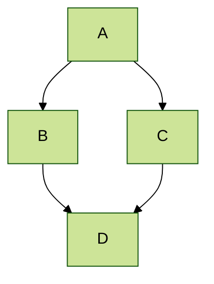
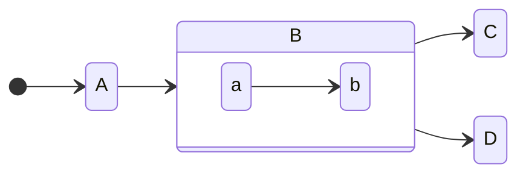
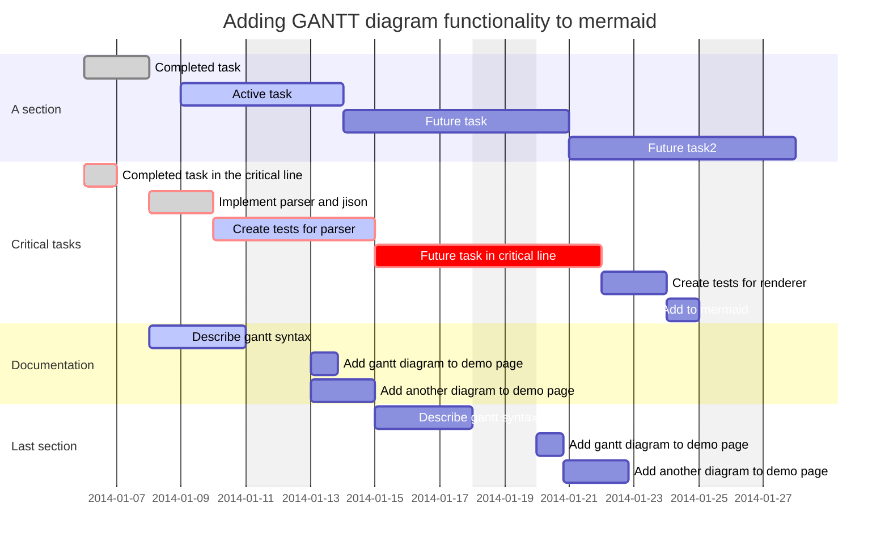

---
page:
  headHtml: |
    <snippet var="js.highlightjs" />
    <snippet var="js.mermaid" />
    <snippet var="js.stork-search" />
---

# Mermaid Diagrams

[Mermaid](https://mermaid-js.github.io/mermaid/#/) lets you create diagrams and visualizations using text and code. You can define these diagrams in your Markdown code blocks. 

1. Add the following to your `page.headHtml`, either in frontmatter or `index.yaml` (see [[yaml-config]])
    ```yaml
    page:
      headHtml: |
        <script src="https://cdn.jsdelivr.net/npm/mermaid/dist/mermaid.min.js"></script>
        <script>
          mermaid.initialize({startOnLoad:false});
          mermaid.init(undefined,document.querySelectorAll(".mermaid"));
        </script>
    ```
1. Add a code block with `mermaid` language
    ~~~markdown
    ```mermaid
    %%{init: {'theme': 'forest', "flowchart" : { "curve" : "basis" } } }%%
    graph TD;
        A-->B;
        A-->C;
        B-->D;
        C-->D;
    ```
    ~~~

The result will be:



Note that mermaid.js will have trouble operating with PrismJS [[syntax-highlighting]], but it works well with highlight.js (which this note uses).

## More examples




