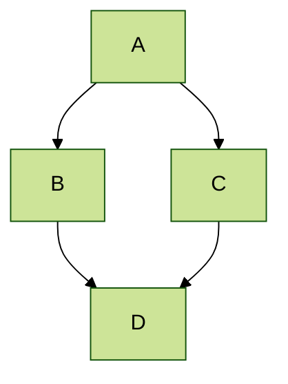
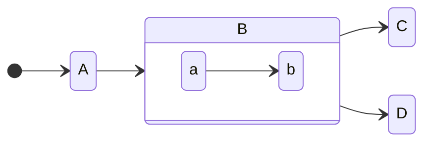
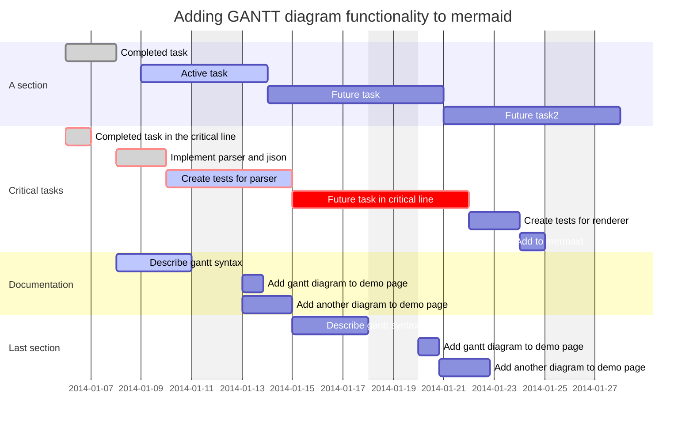
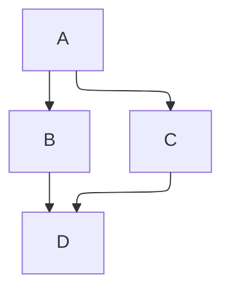

# Mermaid Diagrams

[Mermaid](https://mermaid-js.github.io/mermaid/#/) lets you create diagrams and visualizations using text and code. You can define these diagrams in your Markdown code blocks.

To enable this, add the following to `page.bodyHtml` of [[yaml-config|YAML configuration]] or Markdown frontmatter.

```yaml
page:
  bodyHtml: |
    <snippet var="js.mermaid" />
```

The above alias will add Mermaid `<style>` and `<script>` tags based on Emanote's defaults.

## Example using Mermaid

### Graph diagram

~~~markdown

~~~

Results in:


### State diagram

~~~markdown

~~~

Results in:


### GANTT diagram

~~~markdown

~~~

Results in:


### Layout
Modify the layout via the config `layout`.
The [elk layouts](https://www.npmjs.com/package/@mermaid-js/layout-elk) are supported.

~~~markdown

~~~


The same graph with `dagre` layout:


