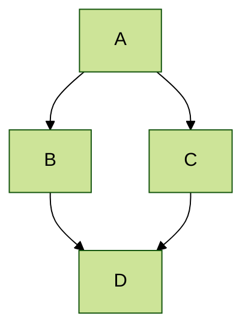
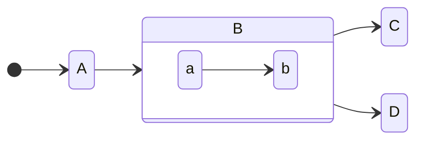
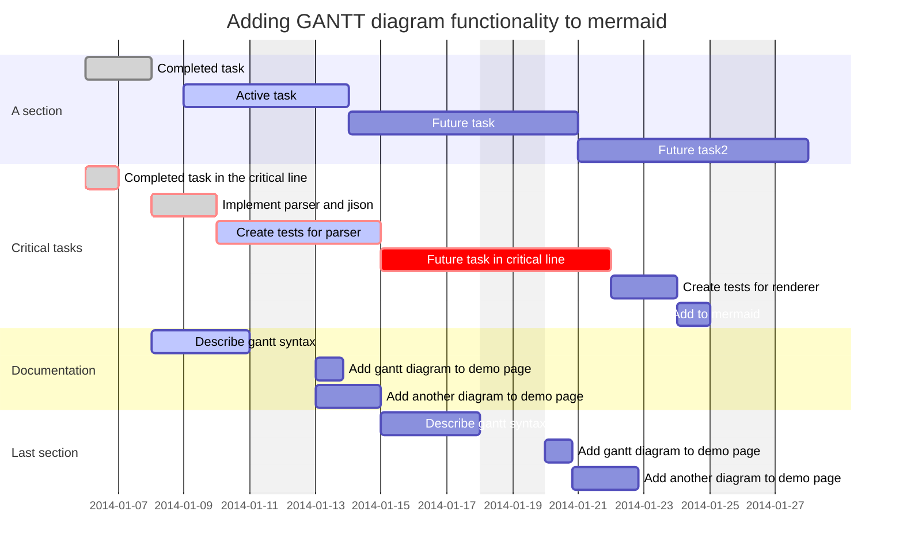
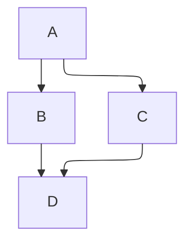
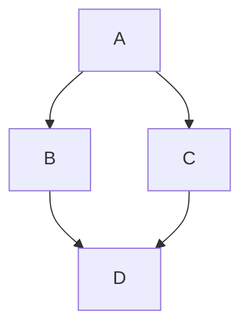

# Mermaid Diagrams

[Mermaid](https://mermaid-js.github.io/mermaid/#/) lets you create diagrams and visualizations using text and code. You can define these diagrams in your Markdown code blocks.

## Inline SVG (default, offline-friendly)

Emanote renders every `mermaid` code block to inline SVG at build time using [`mmdc`](https://github.com/mermaid-js/mermaid-cli) (mermaid-cli). The generated site has no client-side JavaScript dependency for diagrams and works offline. The Nix flake pins `mermaid-cli` as a build/runtime input — same pattern as `tailwindcss` and `stork` — so the binary path is baked in at compile time and you don't need to install anything extra.

Per-diagram render failures preserve the original code block and surface the underlying `mmdc` error inline (and in the document-top error banner) so you can fix the diagram source.

## Client-side rendering (CDN)

If you would rather render diagrams in the browser via the official `mermaid` JavaScript bundle, add the following to `page.bodyHtml` of [[yaml-config|YAML configuration]] or Markdown frontmatter:

```yaml
page:
  bodyHtml: |
    <snippet var="js.mermaid" />
```

This loads `mermaid.js` from a CDN and requires network access to render diagrams. The build-time SVG path is the recommended default.

## Example using Mermaid

### Graph diagram

~~~markdown

```mermaid
%%{init: {'theme': 'forest', "flowchart" : { "curve" : "basis" } } }%%
graph TD;
    A-->B;
    A-->C;
    B-->D;
    C-->D;
```
~~~

Results in:


```mermaid
%%{init: {'theme': 'forest', "flowchart" : { "curve" : "basis" } } }%%
graph TD;
    A-->B;
    A-->C;
    B-->D;
    C-->D;
```

### State diagram

~~~markdown

```mermaid
stateDiagram
    direction LR
    [*] --> A
    A --> B
    B --> C
    state B {
      direction LR
      a --> b
    }
    B --> D
```
~~~

Results in:


```mermaid
stateDiagram
    direction LR
    [*] --> A
    A --> B
    B --> C
    state B {
      direction LR
      a --> b
    }
    B --> D
```

### GANTT diagram

~~~markdown

```mermaid
gantt
    dateFormat  YYYY-MM-DD
    title       Adding GANTT diagram functionality to mermaid
    excludes    weekends
    %% (`excludes` accepts specific dates in YYYY-MM-DD format, days of the week ("sunday") or "weekends", but not the word "weekdays".)

    section A section
    Completed task            :done,    des1, 2014-01-06,2014-01-08
    Active task               :active,  des2, 2014-01-09, 3d
    Future task               :         des3, after des2, 5d
    Future task2              :         des4, after des3, 5d

    section Critical tasks
    Completed task in the critical line :crit, done, 2014-01-06,24h
    Implement parser and jison          :crit, done, after des1, 2d
    Create tests for parser             :crit, active, 3d
    Future task in critical line        :crit, 5d
    Create tests for renderer           :2d
    Add to mermaid                      :1d

    section Documentation
    Describe gantt syntax               :active, a1, after des1, 3d
    Add gantt diagram to demo page      :after a1  , 20h
    Add another diagram to demo page    :doc1, after a1  , 48h

    section Last section
    Describe gantt syntax               :after doc1, 3d
    Add gantt diagram to demo page      :20h
    Add another diagram to demo page    :48h
```
~~~

Results in:


```mermaid
gantt
    dateFormat  YYYY-MM-DD
    title       Adding GANTT diagram functionality to mermaid
    excludes    weekends
    %% (`excludes` accepts specific dates in YYYY-MM-DD format, days of the week ("sunday") or "weekends", but not the word "weekdays".)

    section A section
    Completed task            :done,    des1, 2014-01-06,2014-01-08
    Active task               :active,  des2, 2014-01-09, 3d
    Future task               :         des3, after des2, 5d
    Future task2              :         des4, after des3, 5d

    section Critical tasks
    Completed task in the critical line :crit, done, 2014-01-06,24h
    Implement parser and jison          :crit, done, after des1, 2d
    Create tests for parser             :crit, active, 3d
    Future task in critical line        :crit, 5d
    Create tests for renderer           :2d
    Add to mermaid                      :1d

    section Documentation
    Describe gantt syntax               :active, a1, after des1, 3d
    Add gantt diagram to demo page      :after a1  , 20h
    Add another diagram to demo page    :doc1, after a1  , 48h

    section Last section
    Describe gantt syntax               :after doc1, 3d
    Add gantt diagram to demo page      :20h
    Add another diagram to demo page    :48h
```

### Layout
Modify the layout via the config `layout`.
The [elk layouts](https://www.npmjs.com/package/@mermaid-js/layout-elk) are supported.

~~~markdown

```mermaid
---
config:
  layout: elk
---
graph TD;
    A-->B;
    A-->C;
    B-->D;
    C-->D;
```
~~~


```mermaid
---
config:
  layout: elk
---
graph TD;
    A-->B;
    A-->C;
    B-->D;
    C-->D;
```

The same graph with `dagre` layout:


```mermaid
---
config:
  layout: dagre
---
graph TD;
    A-->B;
    A-->C;
    B-->D;
    C-->D;
```
