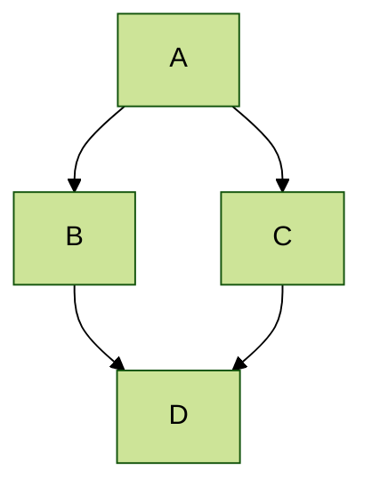
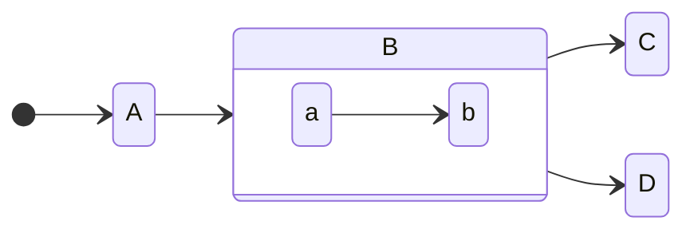
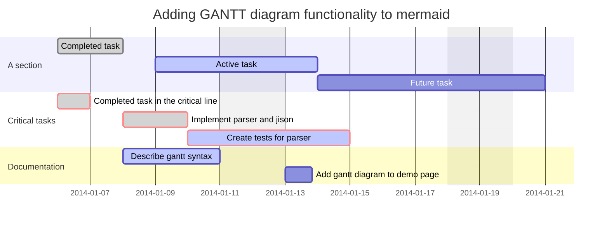
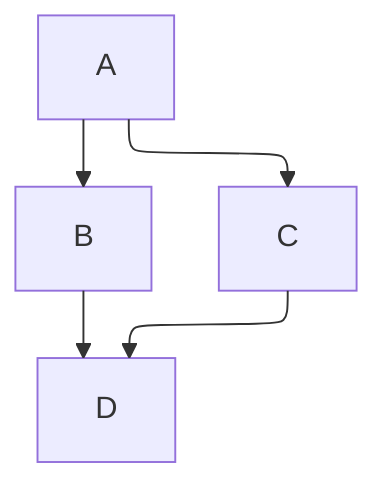

# Client-side Mermaid rendering

The default Mermaid path in Emanote — see [[../mermaid]] — produces inline SVG at build time. That's the recommended approach: works offline, no client-side JavaScript, no network dependency. Use this page only if your build environment can't ship `mmdc`, or you specifically need browser-side rendering for interactive features (e.g. live `prefers-color-scheme` reaction).

To switch a page (or a whole site, via `index.yaml`) to client-side rendering, add the `mermaid.static: false` opt-out and the bundled `js.mermaid` snippet to its frontmatter (or [[../../guide/yaml-config|YAML configuration]]):

```yaml
mermaid:
  static: false
page:
  bodyHtml: |
    <snippet var="js.mermaid" />
```

`mermaid.static: false` tells Emanote to leave `mermaid` code blocks alone so the JavaScript snippet can find them; the snippet then loads `mermaid.js` from a CDN and renders every block in place.

This page itself is configured exactly that way — every diagram below is rendered live in your browser.

Trade-offs versus the default static path:

- Requires network access at view time (CDN).
- Diagrams aren't visible to search engines, screen readers, or offline readers until the JavaScript runs.
- Adds a runtime parsing cost on every page load.
- Honors `prefers-color-scheme` (the snippet reloads the page when the OS toggle flips).

## Demo

The same diagrams as [[../mermaid]], rendered client-side instead.

### Graph diagram



### State diagram



### GANTT diagram



### Layout (elk)


