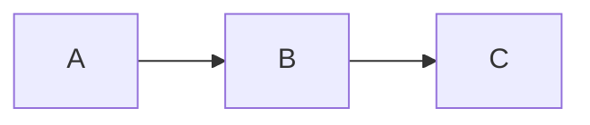

---
page:
  siteTitle: Mermaid Fixture
---

# Mermaid

The fenced block below is rendered to inline SVG at build time by `mmdc`
(see Emanote.Pandoc.Mermaid). The e2e suite asserts that the resulting
page contains an `<svg>` element under `<article>` and no leftover
`<code class="language-mermaid">` source.

